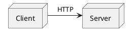
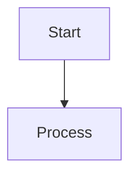

# Diagram Compiler

This skill automates the compilation, export, and formatting of PlantUML and Mermaid diagram blocks inside Markdown files into standard image inclusions.

## Prerequisites

Before running the compiler, make sure you have the necessary binaries installed on your system:

### 1. PlantUML & Graphviz (for PlantUML diagrams)
Make sure `java`, `plantuml`, and `dot` (Graphviz) are available in your path:
*   On macOS (Homebrew):
    ```bash
    brew install graphviz plantuml
    ```

### 2. Mermaid CLI (for Mermaid diagrams)
Make sure the Mermaid command-line interface (`mmdc`) is installed:
*   Install globally via npm:
    ```bash
    npm install -g @mermaid-js/mermaid-cli
    ```

## Step-by-Step Guide

### Step 1: Add Custom Directives (Optional)
By default, the compiler generates a fallback ID based on the markdown file's basename and diagram index. You can explicitly customize the image name and alt text by placing comment directives in the first few lines of your diagram code block.

#### For PlantUML (` ```plantuml ` or ` ```puml `):
Use `' @id:` and `' @alt:` comments:


#### For Mermaid (` ```mermaid `):
Use `%% @id:` and `%% @alt:` comments:


### Step 2: Run the Compiler
Invoke the compiler script located at `references/compile_diagrams.py` relative to this skill's root folder:

```bash
uv run .agents/skills/diagram-compiler/references/compile_diagrams.py --src <source_path> [options]
```

#### CLI Options:
*   `--src`: Source Markdown file or folder directory to scan recursively. (Default: `.`)
*   `--out`: Name of the output folder for compiled images. Created relative to the Markdown file. (Default: `Figure`)
*   `--format`: Output image format, choose between `png` or `svg`. (Default: `png`)
*   `--type`: Which diagrams to compile, choose between `plantuml`, `mermaid`, or `both`. (Default: `both`)
*   `--relative-path`: The relative path prefix inserted into the markdown image links. (Default: `../Figure`)

### Examples

#### Compile both types recursively in the project and output SVGs:
```bash
uv run .agents/skills/diagram-compiler/references/compile_diagrams.py --src ./graduation-thesis/project3-md --format svg
```

#### Compile only Mermaid diagrams in a specific file:
```bash
uv run .agents/skills/diagram-compiler/references/compile_diagrams.py --src ./docs/workflow.md --type mermaid --relative-path ./Figure
```

---

## Working Agreement
*   **Keep original diagrams backed up**: The tool edits markdown files in place. Keep version control clean so changes can be easily reviewed.
*   **Install dependencies before executing**: Always check if `plantuml` and `mmdc` are available on the user's PATH. Warn the user if they are missing.
