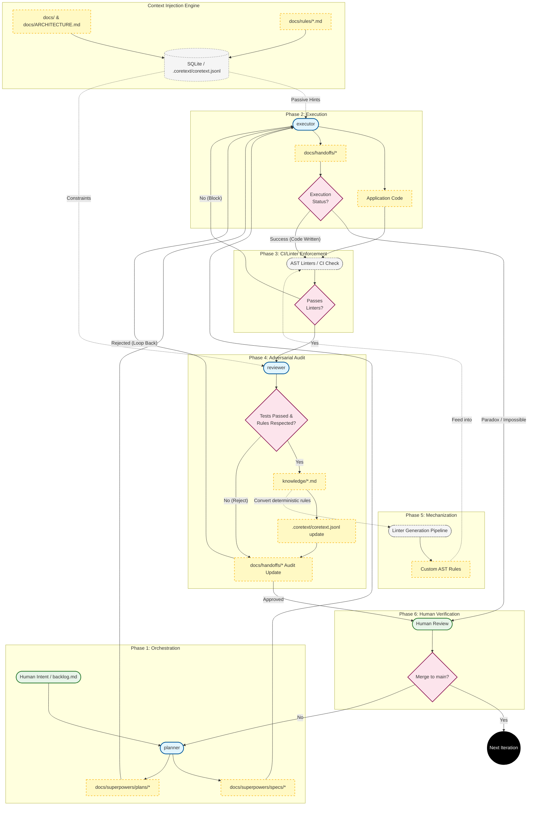

```mermaid
flowchart TB
    %% --- STYLING ---
    classDef agent fill:#e1f5fe,stroke:#01579b,stroke-width:2px;
    classDef artifact fill:#fff9c4,stroke:#fbc02d,stroke-width:2px,stroke-dasharray: 5 5;
    classDef decision fill:#fce4ec,stroke:#880e4f,stroke-width:2px;
    classDef system fill:#f5f5f5,stroke:#616161,stroke-width:1px,stroke-dasharray: 3 3;
    classDef human fill:#e8f5e9,stroke:#2e7d32,stroke-width:2px;
    classDef endstate fill:#000,stroke:#000,stroke-width:2px,color:#fff;

    %% --- JIT CONTEXT ---
    subgraph JIT ["Context Injection Engine"]
        direction LR
        K_Docs[docs/ & docs/ARCHITECTURE.md]:::artifact
        K_Hints[docs/rules/*.md]:::artifact
        Sys_DB[(SQLite / .coretext/coretext.jsonl)]:::system
        
        K_Docs --> Sys_DB
        K_Hints --> Sys_DB
    end

    %% --- PHASE 1: ORCHESTRATION ---
    subgraph P1 ["Phase 1: Orchestration"]
        direction TB
        H_Backlog([Human Intent / backlog.md]):::human
        A_Planner([planner]):::agent
        A_Spec[docs/superpowers/specs/*]:::artifact
        A_Plan[docs/superpowers/plans/*]:::artifact

        H_Backlog --> A_Planner
        A_Planner --> A_Spec
        A_Planner --> A_Plan
    end

    %% --- PHASE 2: EXECUTION ---
    subgraph P2 ["Phase 2: Execution"]
        direction TB
        A_Executor([executor]):::agent
        A_Code[Application Code]:::artifact
        A_Handoff_Exec[docs/handoffs/*]:::artifact
        Check_Exec{Execution<br/>Status?}:::decision

        A_Executor --> A_Code
        A_Executor --> A_Handoff_Exec
        A_Handoff_Exec --> Check_Exec
    end

    %% --- PHASE 3: ELECTRIC FENCE (CI/LINTERS) ---
    subgraph P3 ["Phase 3: CI/Linter Enforcement"]
        direction TB
        Sys_Linter([AST Linters / CI Check]):::system
        Check_Lint{Passes<br/>Linters?}:::decision
        
        A_Code --> Sys_Linter
        Sys_Linter --> Check_Lint
    end

    %% --- PHASE 4: AUDIT ---
    subgraph P4 ["Phase 4: Adversarial Audit"]
        direction TB
        A_Reviewer([reviewer]):::agent
        Check_Audit{Tests Passed &<br/>Rules Respected?}:::decision
        A_Knowledge[knowledge/*.md]:::artifact
        A_ExpUpdate[.coretext/coretext.jsonl update]:::artifact
        A_Handoff_Final[docs/handoffs/* Audit Update]:::artifact

        A_Reviewer --> Check_Audit
        Check_Audit -- Yes --> A_Knowledge
        A_Knowledge --> A_ExpUpdate
        A_ExpUpdate --> A_Handoff_Final
        Check_Audit -- No (Reject) --> A_Handoff_Final
    end

    %% --- PHASE 5: MECHANIZATION ---
    subgraph P5 ["Phase 5: Mechanization"]
        direction TB
        Sys_RulePipeline([Linter Generation Pipeline]):::system
        A_NewLinter[Custom AST Rules]:::artifact
        
        A_Knowledge -. "Convert deterministic rules" .-> Sys_RulePipeline
        Sys_RulePipeline --> A_NewLinter
        A_NewLinter -. "Feed into" .-> Sys_Linter
    end

    %% --- PHASE 6: VERIFICATION ---
    subgraph P6 ["Phase 6: Human Verification"]
        direction TB
        H_Verify([Human Review]):::human
        Check_Merge{Merge to main?}:::decision

        H_Verify --> Check_Merge
    end
    
    Finish((Next Iteration)):::endstate

    %% --- MAIN CONNECTIONS ---
    Sys_DB -. Passive Hints .-> A_Executor
    Sys_DB -. Constraints .-> A_Reviewer
    
    A_Spec --> A_Executor
    A_Plan --> A_Executor
    
    Check_Exec -- "Paradox / Impossible" --> H_Verify
    Check_Exec -- "Success (Code Written)" --> Sys_Linter
    
    Check_Lint -- Yes --> A_Reviewer
    Check_Lint -- No (Block) --> A_Executor
    
    A_Handoff_Final -- "Approved" --> H_Verify
    A_Handoff_Final -- "Rejected (Loop Back)" --> A_Executor
    
    Check_Merge -- Yes --> Finish
    Check_Merge -- No --> A_Planner
    
    %% Layout Helpers
    JIT ~~~ P1
```