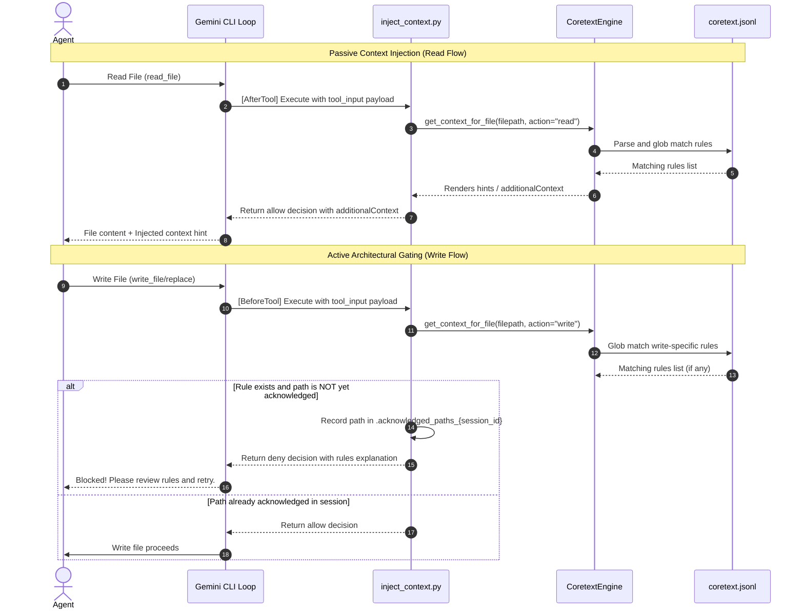

# Coretext Hooks & Context Injection

Coretext integrates directly with the agentic loop interface (such as Gemini CLI) using synchronous hooks to inject architectural context dynamically (Just-in-Time) and enforce architectural guidelines automatically.

This document describes how hooks are configured, how they interact with the Coretext matching engine, and the exact lifecycles for both passive context injection (on file reads) and active gating/acknowledgement (on file writes).

---

## 1. Overview of Hook Integration

Coretext utilizes two primary types of hooks in the agent loop:
1. **Passive Context Injection (`AfterTool` / Read):** Appends relevant architectural rules and hints to the agent's tool outputs when it reads source files.
2. **Active Architectural Gating (`BeforeTool` / Write):** Temporarily blocks file writes or replacements if the target file has associated rules, forcing the agent to read and acknowledge the guidelines before proceeding.
3. **Visual Feedback Telemetry (Both phases):** Records file access logs to session-specific files to power the real-time visual graph dashboard.



---

## 2. Gemini CLI Hook Configuration

Hooks are registered and configured under the `"hooks"` block in the project's [.gemini/settings.json](../../.gemini/settings.json) file.

### Hook Event Merging Axiom
To ensure multiple hooks for the same tool event execute successfully, matchers are merged in `.gemini/settings.json`. For example, both `inject_context.py` and `notify_action.py` for writes are grouped under a single `matcher` block (`"matcher": "write_file|replace"`):

```json
{
  "hooks": {
    "BeforeTool": [
      {
        "matcher": "write_file|replace",
        "hooks": [
          {
            "name": "coretext-context-injector-write",
            "type": "command",
            "command": "python3 $GEMINI_PROJECT_DIR/.coretext/inject_context.py",
            "description": "Checks if context from Coretext exists before an agent writes to a file, and disrupts the action if context is found."
          },
          {
            "name": "coretext-visual-feedback",
            "type": "command",
            "command": "python3 $GEMINI_PROJECT_DIR/.coretext/notify_action.py",
            "description": "Notifies the visualization dashboard to highlight the modified file."
          }
        ]
      }
    ],
    "AfterTool": [
      {
        "matcher": "read_file",
        "hooks": [
          {
            "name": "coretext-context-injector-read",
            "type": "command",
            "command": "python3 $GEMINI_PROJECT_DIR/.coretext/inject_context.py",
            "description": "Injects context from Coretext immediately after an agent reads a source code file."
          },
          {
            "name": "coretext-visual-feedback",
            "type": "command",
            "command": "python3 $GEMINI_PROJECT_DIR/.coretext/notify_action.py",
            "description": "Notifies the visualization dashboard to highlight the read file."
          }
        ]
      }
    ]
  },
  "hooksConfig": {
    "enabled": true,
    "disabled": [
      "coretext-context-injector-write",
      "coretext-context-injector-read"
    ]
  }
}
```

---

## 3. Communication Protocol & Payload Structure

Hooks communicate with the Gemini CLI via standard streams using JSON payloads:
- **Input (`stdin`):** Receives the tool context and session information.
- **Output (`stdout`):** Must output a single, valid JSON object specifying the decision. No other stdout output is allowed.
- **Diagnostics (`stderr`):** Captured for logs and error handling.

### Hook Input Payload Fields
The JSON object passed into the script's `stdin` conforms to the following structure:
- `tool_name` (string): The name of the tool being executed (e.g., `view_file`, `write_to_file`, `replace_file_content`).
- `tool_input` (object): Arguments passed to the tool containing target file paths (typically key name `AbsolutePath`, `file_path`, or `TargetFile`).
- `session_id` (string): Unique identifier for the active agent session.
- `hook_event_name` (string): The type of hook lifecycle event (`BeforeTool` or `AfterTool`).

### Hook Output Payload Fields
The hook's output JSON returned on `stdout` supports:
- `decision` (string): `"allow"` or `"deny"`.
- `reason` (string): Explanation presented to the agent if the decision is `"deny"`.
- `hookSpecificOutput` (object): Holds additional context:
  - `additionalContext` (string): Content appended to the tool response for `AfterTool` events.

---

## 4. Context Injector Script (`inject_context.py`)

The [.coretext/inject_context.py](../../.coretext/inject_context.py) script orchestrates matching and rendering context payload using the `CoretextEngine`.

### A. Read Operation Lifecycle (`AfterTool` Hook)
When an agent calls `view_file`, the `AfterTool` hook executes `inject_context.py` with `action="read"`.
1. The script extracts the absolute path of the file being read.
2. It initializes the `CoretextEngine` and calls `render_context_payload(file_path, "read")`.
3. The engine parses the event log (`.coretext/{workspace_name}.jsonl`), matches the file path using Python's glob matching (`fnmatch`), and retrieves linked targets.
4. If there are hints/rules associated with the file, they are combined and returned in the hook output under `hookSpecificOutput.additionalContext`.
5. The Gemini CLI appends these hints to the `view_file` response, giving the agent Just-in-Time guidance about the file it just opened.

### B. Write / Modify Operation Lifecycle (`BeforeTool` Hook)
When an agent calls a file modifying tool (e.g., `write_to_file`, `replace_file_content`, `multi_replace_file_content`), the `BeforeTool` hook executes `inject_context.py` with `action="write"`.
1. The script extracts the path of the file being written to.
2. It queries `CoretextEngine` for rules linked via `write` or `both` hooks.
3. If no rules exist, it prints `{"decision": "allow"}` and exits.
4. If rules exist, it namespaces the check using the `session_id` to locate the acknowledgement file: `.coretext/.acknowledged_paths_{session_id}`.
5. **If the path is NOT in the acknowledgement file:**
   - The path is appended to the acknowledgment file.
   - The script returns a deny decision:
     ```json
     {
       "decision": "deny",
       "reason": "ACTION BLOCKED: You must read and acknowledge the following architectural rules... [Rules details]"
     }
     ```
   - This blocks the agent's tool execution, forcing it to read the architectural rules.
6. **If the path is already in the acknowledgement file:**
   - The script returns:
     ```json
     {
       "decision": "allow"
     }
     ```
   - The write tool execution proceeds normally.

---

## 5. Visual Telemetry Hook (`notify_action.py`)

In parallel to context injection, the [.coretext/notify_action.py](../../.coretext/notify_action.py) script records telemetry data for real-time visualization:
1. Triggers on both read/write events.
2. Reads the tool invocation parameters from `stdin`.
3. Normalizes the target file path relative to the environment variable `GEMINI_PROJECT_DIR`.
4. Appends a structured log entry into the session-specific file `.coretext/sessions/session_{session_id}.jsonl`:
   ```json
   {"node_id": "src/api/auth.py", "timestamp": "2026-05-26T12:00:00.000", "tool_name": "view_file"}
   ```
5. The `coretext-graph-ui` React application parses this file to dynamically highlight active paths and files in the live architecture dashboard.
