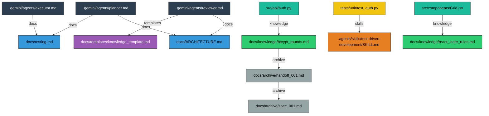

# Coretext Structural Graph

This graph visualizes the structural context injection edges defined in `.coretext/coretext.jsonl`.

```mermaid
graph TD
    classDef agents fill:#2c3e50,stroke:#333,stroke-width:1px,color:white;
    classDef skills fill:#e67e22,stroke:#333,stroke-width:1px,color:black;
    classDef docs fill:#3498db,stroke:#333,stroke-width:1px,color:black;
    classDef knowledge fill:#2ecc71,stroke:#333,stroke-width:1px,color:black;
    classDef templates fill:#9b59b6,stroke:#333,stroke-width:1px,color:white;
    classDef archive fill:#95a5a6,stroke:#333,stroke-width:1px,color:black;
    classDef coretext fill:#e74c3c,stroke:#333,stroke-width:1px,color:white;
    classDef src fill:#1abc9c,stroke:#333,stroke-width:1px,color:black;
    classDef tests fill:#f1c40f,stroke:#333,stroke-width:1px,color:black;
    _gemini_agents_planner_md[".gemini/agents/planner.md"] -->|docs| docs_ARCHITECTURE_md["docs/ARCHITECTURE.md"]
    _gemini_agents_planner_md[".gemini/agents/planner.md"] -->|docs| docs_testing_md["docs/testing.md"]
    _gemini_agents_executor_md[".gemini/agents/executor.md"] -->|docs| docs_testing_md["docs/testing.md"]
    _gemini_agents_reviewer_md[".gemini/agents/reviewer.md"] -->|docs| docs_ARCHITECTURE_md["docs/ARCHITECTURE.md"]
    src_api_auth_py["src/api/auth.py"] -->|knowledge| docs_knowledge_bcrypt_rounds_md["docs/knowledge/bcrypt_rounds.md"]
    _gemini_agents_reviewer_md[".gemini/agents/reviewer.md"] -->|templates| docs_templates_knowledge_template_md["docs/templates/knowledge_template.md"]
    docs_knowledge_bcrypt_rounds_md["docs/knowledge/bcrypt_rounds.md"] -->|archive| docs_archive_handoff_001_md["docs/archive/handoff_001.md"]
    docs_archive_handoff_001_md["docs/archive/handoff_001.md"] -->|archive| docs_archive_spec_001_md["docs/archive/spec_001.md"]
    tests_unit_test_auth_py["tests/unit/test_auth.py"] -->|skills| _agents_skills_test_driven_development_SKILL_md[".agents/skills/test-driven-development/SKILL.md"]
    src_components_Grid_jsx["src/components/Grid.jsx"] -->|knowledge| docs_knowledge_react_state_rules_md["docs/knowledge/react_state_rules.md"]
    class tests_unit_test_auth_py tests
    class _agents_skills_test_driven_development_SKILL_md skills
    class docs_testing_md docs
    class docs_ARCHITECTURE_md docs
    class _gemini_agents_reviewer_md agents
    class src_api_auth_py src
    class docs_knowledge_bcrypt_rounds_md knowledge
    class docs_templates_knowledge_template_md templates
    class docs_archive_handoff_001_md archive
    class docs_archive_spec_001_md archive
    class docs_knowledge_react_state_rules_md knowledge
    class _gemini_agents_planner_md agents
    class src_components_Grid_jsx src
    class _gemini_agents_executor_md agents
```
