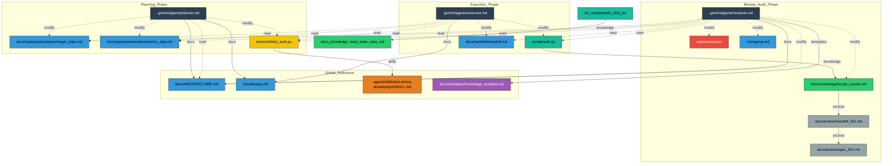

# Coretext Lifecycle Graph

This graph visualizes the agent operational lifecycle (read/modify) on top of the structural dependencies, grouped by phase.

```mermaid
graph TD
    classDef agents fill:#2c3e50,stroke:#333,stroke-width:1px,color:white;
    classDef skills fill:#e67e22,stroke:#333,stroke-width:1px,color:black;
    classDef docs fill:#3498db,stroke:#333,stroke-width:1px,color:black;
    classDef knowledge fill:#2ecc71,stroke:#333,stroke-width:1px,color:black;
    classDef templates fill:#9b59b6,stroke:#333,stroke-width:1px,color:white;
    classDef archive fill:#95a5a6,stroke:#333,stroke-width:1px,color:black;
    classDef coretext fill:#e74c3c,stroke:#333,stroke-width:1px,color:white;
    classDef src fill:#1abc9c,stroke:#333,stroke-width:1px,color:black;
    classDef tests fill:#f1c40f,stroke:#333,stroke-width:1px,color:black;
    subgraph Planning_Phase
        _gemini_agents_planner_md[".gemini/agents/planner.md"]
        docs_superpowers_specs_target_state_md["docs/superpowers/specs/target_state.md"]
        docs_superpowers_plans_atomic_step_md["docs/superpowers/plans/atomic_step.md"]
        tests_unit_test_auth_py["tests/unit/test_auth.py"]
    end
    subgraph Execution_Phase
        _gemini_agents_executor_md[".gemini/agents/executor.md"]
        src_api_auth_py["src/api/auth.py"]
        docs_handoffs_handoff_md["docs/handoffs/handoff.md"]
    end
    subgraph Review_Audit_Phase
        _gemini_agents_reviewer_md[".gemini/agents/reviewer.md"]
        docs_knowledge_bcrypt_rounds_md["docs/knowledge/bcrypt_rounds.md"]
        experience_json["experience.json"]
        changelog_md["changelog.md"]
        docs_archive_handoff_001_md["docs/archive/handoff_001.md"]
        docs_archive_spec_001_md["docs/archive/spec_001.md"]
    end
    subgraph Global_Reference
        docs_ARCHITECTURE_md["docs/ARCHITECTURE.md"]
        docs_testing_md["docs/testing.md"]
        _agents_skills_test_driven_development_SKILL_md[".agents/skills/test-driven-development/SKILL.md"]
        docs_templates_knowledge_template_md["docs/templates/knowledge_template.md"]
    end
    _gemini_agents_planner_md -->|docs| docs_ARCHITECTURE_md
    _gemini_agents_planner_md -->|docs| docs_testing_md
    _gemini_agents_executor_md -->|docs| docs_testing_md
    _gemini_agents_reviewer_md -->|docs| docs_ARCHITECTURE_md
    src_api_auth_py -->|knowledge| docs_knowledge_bcrypt_rounds_md
    _gemini_agents_reviewer_md -->|templates| docs_templates_knowledge_template_md
    docs_knowledge_bcrypt_rounds_md -->|archive| docs_archive_handoff_001_md
    docs_archive_handoff_001_md -->|archive| docs_archive_spec_001_md
    tests_unit_test_auth_py -->|skills| _agents_skills_test_driven_development_SKILL_md
    src_components_Grid_jsx -->|knowledge| docs_knowledge_react_state_rules_md
    _gemini_agents_planner_md -.->|read| docs_ARCHITECTURE_md
    _gemini_agents_planner_md -.->|modify| tests_unit_test_auth_py
    _gemini_agents_planner_md -.->|modify| docs_superpowers_specs_target_state_md
    _gemini_agents_planner_md -.->|modify| docs_superpowers_plans_atomic_step_md
    _gemini_agents_executor_md -.->|read| docs_superpowers_specs_target_state_md
    _gemini_agents_executor_md -.->|read| docs_superpowers_plans_atomic_step_md
    _gemini_agents_executor_md -.->|read| tests_unit_test_auth_py
    _gemini_agents_executor_md -.->|modify| src_api_auth_py
    _gemini_agents_executor_md -.->|modify| docs_handoffs_handoff_md
    _gemini_agents_reviewer_md -.->|read| docs_superpowers_specs_target_state_md
    _gemini_agents_reviewer_md -.->|read| docs_superpowers_plans_atomic_step_md
    _gemini_agents_reviewer_md -.->|read| tests_unit_test_auth_py
    _gemini_agents_reviewer_md -.->|read| src_api_auth_py
    _gemini_agents_reviewer_md -.->|read| docs_handoffs_handoff_md
    _gemini_agents_reviewer_md -.->|modify| docs_knowledge_bcrypt_rounds_md
    _gemini_agents_reviewer_md -.->|modify| docs_ARCHITECTURE_md
    _gemini_agents_reviewer_md -.->|modify| changelog_md
    _gemini_agents_reviewer_md -.->|modify| experience_json
    class changelog_md docs
    class _gemini_agents_reviewer_md agents
    class docs_superpowers_specs_target_state_md docs
    class docs_ARCHITECTURE_md docs
    class _agents_skills_test_driven_development_SKILL_md skills
    class _gemini_agents_planner_md agents
    class tests_unit_test_auth_py tests
    class docs_superpowers_plans_atomic_step_md docs
    class src_api_auth_py src
    class docs_knowledge_bcrypt_rounds_md knowledge
    class docs_archive_spec_001_md archive
    class docs_handoffs_handoff_md docs
    class docs_templates_knowledge_template_md templates
    class docs_knowledge_react_state_rules_md knowledge
    class experience_json coretext
    class docs_testing_md docs
    class _gemini_agents_executor_md agents
    class src_components_Grid_jsx src
    class docs_archive_handoff_001_md archive
```
