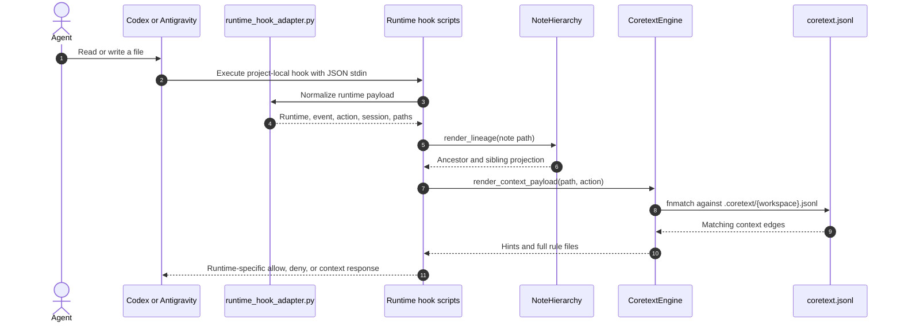

# Coretext Hooks & Context Injection

Coretext integrates with supported agent runtimes through project-local hooks. The supported runtime hook platforms are Codex and Antigravity.

Hooks provide four behaviors:
1. **Graph read context:** append compact Coretext edge hints after supported read tools expose a stable target path.
2. **Note lineage injection:** append the ancestor and sibling projection for explicit reads of top-level knowledge notes.
3. **Write gating:** block a write once per session when Coretext context exists for the target path, forcing the agent to read and acknowledge the relevant rules before retrying.
4. **Visual telemetry:** append file access events to session JSONL logs for the local dashboard.



---

## 1. Runtime Configs

### Antigravity

Antigravity hooks live in the project-local [.agents/hooks.json](../.agents/hooks.json) file.

Coretext defines:
- `coretext-note-lineage`: `PreToolUse` queueing for `view_file` plus `PreInvocation` delivery.
- `coretext-context-injector-write`: `PreToolUse` write guard for `write_to_file`, `replace_file_content`, and `multi_replace_file_content`.
- `coretext-visual-feedback`: `PreToolUse` telemetry for file reads and writes.

For the current workspace, hooks are enabled (`"enabled": true`). During package setup, the `.agents/hooks.json` configuration file is enabled by default. However, users on the platform must trust the project-local hook configuration manually before they will fire. Note lineage uses the path available before `view_file`; graph-edge read context remains skipped because the documented `PostToolUse` payload does not include the completed tool call path.

### Codex

Codex hooks live in project-local [.codex/hooks.json](../.codex/hooks.json). The project-local [.codex/config.toml](../.codex/config.toml) enables hooks by default:

```toml
[features]
hooks = true
```

Coretext defines:
- `PreToolUse` lineage hooks for read/view-like MCP tools.
- `PreToolUse` write guards for `apply_patch`, edit/write aliases, and write-like MCP tools.
- `PostToolUse` hooks for read/view-like MCP tools where the payload includes a stable target path.

Codex support is enabled by default during project setup, but requires users to trust the project-local hooks configuration manually through the Codex command interface (`/hooks`) before they execute. No global or user-level Codex configuration is modified.

---

## 2. Shared Adapter

The [.coretext/runtime_hook_adapter.py](../.coretext/runtime_hook_adapter.py) module is the compatibility layer for supported runtimes. It:
- detects Antigravity, Codex, or unsupported payloads;
- extracts tool names, events, session IDs, and tool arguments;
- extracts paths from common arguments such as `path`, `file_path`, `AbsolutePath`, and `TargetFile`;
- parses Codex `apply_patch` headers such as `*** Update File: path`;
- normalizes absolute paths to project-relative Coretext graph node IDs;
- recognizes Antigravity `PreInvocation` payloads from invocation metadata;
- formats runtime-specific allow, deny, and context responses.

Unsupported payloads are ignored and return a no-op response. This keeps removed or unknown runtime integrations from accidentally receiving Coretext context.

---

## 3. Note Lineage Injector

The [.coretext/inject_lineage.py](../.coretext/inject_lineage.py) script is separate from graph-edge context injection and write gating. It calls `NoteHierarchy.render_lineage` and never reads note contents.

Lineage is eligible only when all of these conditions hold:

1. The runtime is Codex or Antigravity.
2. The event is an explicit `PreToolUse` read/view call.
3. The normalized path is exactly `knowledge/*.md` or `knowledge/ai/*.md`.
4. The note exists and has not already been delivered in the session.

Archive paths, nested knowledge paths, non-Markdown files, missing notes, shell commands, writes, malformed payloads, and unsupported runtimes are ignored. State access is best-effort and hook failures do not block the tool call.

### Codex Lifecycle

1. A read/view-like MCP tool triggers `PreToolUse`.
2. The hook renders the normalized note path through `NoteHierarchy.render_lineage`.
3. It returns `hookSpecificOutput` with `hookEventName: "PreToolUse"` and the rendered `additionalContext`.
4. Only paths included in `additionalContext` are appended to `.coretext/.lineage_seen_{session_id}`.

Codex therefore receives lineage immediately before the explicit read.

### Antigravity Lifecycle

1. `PreToolUse` for `view_file` renders eligible lineage and appends `{path, lineage}` JSON objects to `.coretext/.pending_lineage_{session_id}.jsonl`.
2. Repeated queue attempts for the same normalized path are deduplicated. Queueing does not mark the note as seen.
3. The next `PreInvocation` combines pending lineage into one `ephemeralMessage` under `injectSteps`.
4. Delivered paths are appended to `.coretext/.lineage_seen_{session_id}`, then the pending file is cleared.
5. When no pending lineage exists, the hook returns `{"injectSteps":[]}`.

Antigravity therefore allows the file view first and injects its queued lineage before the next model invocation. Session IDs in both state filenames are sanitized by the shared adapter.

## 4. Context Injector

The [.coretext/inject_context.py](../.coretext/inject_context.py) script handles read context and write gating.

### Read Context

1. The adapter extracts a supported runtime payload and normalized file path.
2. The script calls `CoretextEngine.render_context_payload(path, "read")`.
3. Matching `hint` and `full` edges are rendered from `.coretext/{workspace}.jsonl`.
4. Codex `PostToolUse` read hooks return `hookSpecificOutput.additionalContext`.
5. Antigravity read context is skipped until its stable post-read path is available.

### Write Gating

1. The adapter extracts one or more write paths from Antigravity or Codex.
2. The script calls `CoretextEngine.render_context_payload(path, "write")`.
3. If no context exists, the hook returns the runtime's allow/no-op response.
4. If context exists, the script checks `.coretext/.acknowledged_paths_{session_id}`.
5. The first write attempt for a matching path is denied and the path is recorded.
6. A retry in the same session is allowed.

Codex uses `hookSpecificOutput.permissionDecision = "deny"`. Antigravity uses `decision = "deny"` with a `reason`.

---

## 5. Telemetry (Deprecated / Post-Execution Export)

Telemetry is no longer recorded in real-time during execution (the [.coretext/notify_action.py](../.coretext/notify_action.py) hook is deprecated and serves as a silent no-op). Instead, telemetry is extracted post-execution using the `export` skill.

1. The export skill extracts the raw conversation transcript after the execution.
2. The `ingest_transcript.py` script reformats the raw transcript into a unified tool call history file in `.coretext-data/sessions/{session_id}.jsonl`.
3. Each entry includes `node_id`, `timestamp`, `tool_name`, and classified `action` (`read`/`write`).

Example:

```json
{"node_id": "src/api/auth.py", "timestamp": "2026-06-26T10:44:37Z", "tool_name": "view_file", "action": "read"}
```

The local graph dashboard reads these post-execution session logs to highlight active files.
