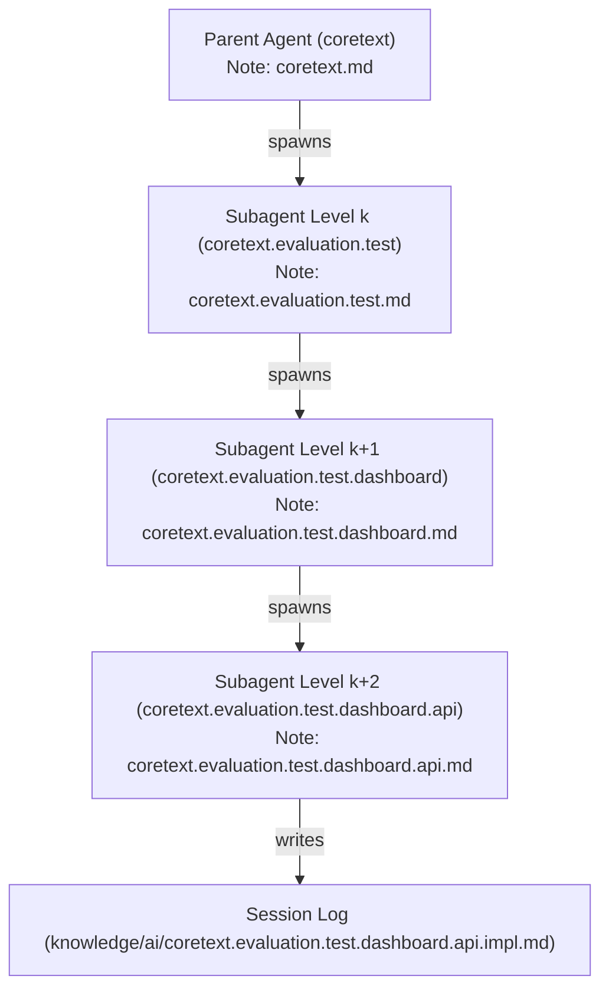

# Coretext Multi-Agent Teamwork Guide

For packaged evaluation runs and delegated agent sessions, use [coretext_agent_instruction.md](coretext_agent_instruction.md) as the single consolidated operating contract. This file remains the subagent-specific source guide behind that contract.

This document defines the guidelines and protocols for orchestrating multi-agent teamwork sessions in Coretext. It ensures that all spawned subagents adhere to the `knowledge` skill note-taking structures and maintain repository cleanliness across arbitrary scope depths.

---

## 1. Core Vision

In Coretext, the **agent delegation tree is isomorphic to the project note-classification tree**. Every subagent spawned within a teamwork session must represent a specific, namespaced scope in the repository's knowledge vault.

---

## 2. Naming & Permission Axioms

To prevent context leakage, avoid repository clutter, and leverage JIT context injection:

1. **Dotted Namespace Identity**: A subagent's `Role` name must match the dot-separated path of its corresponding scope note in `knowledge/` (e.g. `coretext.evaluation.test.dashboard` for `knowledge/coretext.evaluation.test.dashboard.md`).
2. **Writing Restrictions (The Scope Gate)**:
   - **Stable Notes**: Only the agent assigned to a specific scope level $k$ is permitted to create or modify the stable scope note at that level (`knowledge/coretext.evaluation.test.md` or `knowledge/coretext.evaluation.test.dashboard.md`).
   - **Session Notes**: Lower-level worker agents (Level $k+1$, $k+2$, etc.) must *only* write to their corresponding session logs under `knowledge/ai/` (e.g. `knowledge/ai/coretext.evaluation.test.dashboard.session-1.md`).
3. **Zero Root Pollution**: Under no circumstances should subagents write transient coordination files (e.g., `progress.md`, `ORIGINAL_REQUEST.md`, `tasks.md`) in the repository root or `.agents/` folder. All progress logs must reside in namespaced session notes.
4. **Shared Skill Usage**: All subagents must use `Workspace: "share"` or `Workspace: "inherit"` to access repository-local skills (like `.agents/skills/knowledge/`) to explore the codebase and write structured notes.

---

## 3. Recursive $N$-Level Delegation Protocol

The mapping protocol scales recursively to $N$ levels of nesting:

### Protocol Steps at Level $k$ (for any depth $k \ge 1$):

1. **Intake and Orientation**:
   - The agent at Level $k$ receives a task scoped under the dotted namespace `project.scope_1...scope_k`.
   - The agent uses the `knowledge` skill's explore workflow to read its corresponding scope note (`knowledge/project.scope_1...scope_k.md`) and parent scope notes to extract the goal, constraints, and strategy.
2. **Sub-Task Delegation**:
   - If the task requires specialized or concurrent execution, the Level $k$ agent breaks the task down into sub-scopes (`project.scope_1...scope_k.sub-scope`).
   - It defines and spawns a Level $k+1$ subagent with:
     - `Role`: `project.scope_1...scope_k.sub-scope`
     - `Prompt`: "Orient yourself using the `knowledge` skill on `knowledge/project.scope_1...scope_k.sub-scope.md`. Execute [Task Details]. Write your session log directly to `knowledge/ai/` and report back."
3. **Execution and Session Compilation**:
   - The Level $k+1$ agent executes the task (writing code or running tests).
   - Once complete, it uses the `knowledge` skill's summary workflow to write a structured session log note under `knowledge/ai/project.scope_1...scope_k.sub-scope.[session-name].md`.
   - It notifies the Level $k$ agent and transitions to **Idle**.
4. **Ascending Distillation**:
   - The Level $k$ agent reads the session log, updates its own stable scope note (`knowledge/project.scope_1...scope_k.md`) with durable deltas, and reports status back to its parent (Level $k-1$).

---

## 4. Verification Checklist for Teamwork Audits

When auditing a teamwork session, the Victory Auditor must check:

- [ ] **Role Mapping**: Do all spawned subagent roles match their target note namespaces?
- [ ] **Write Boundaries**: Did subagents write only to `knowledge/ai/` session logs, leaving durable scope notes to be updated by their parents?
- [ ] **Workspace Cleanliness**: Are there any untracked or transient markdown files remaining in the root folder or `.agents/`?
- [ ] **Wikilink Integrity**: Do all new notes link correctly to their direct parent or child notes without skipping levels?
