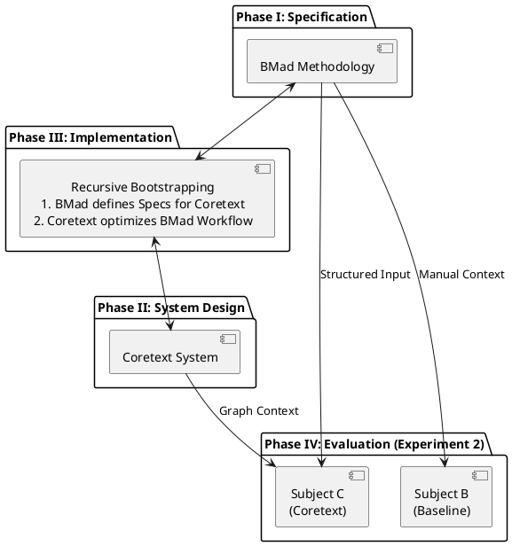
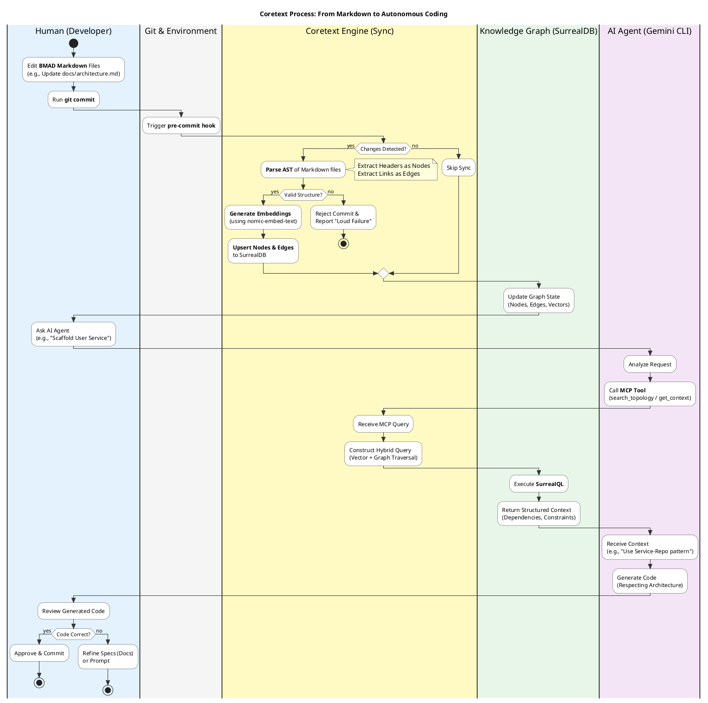
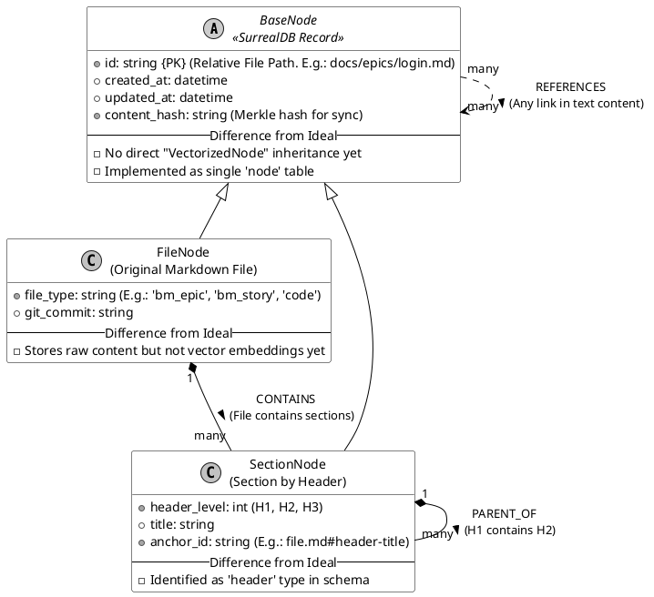
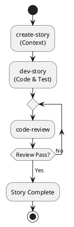
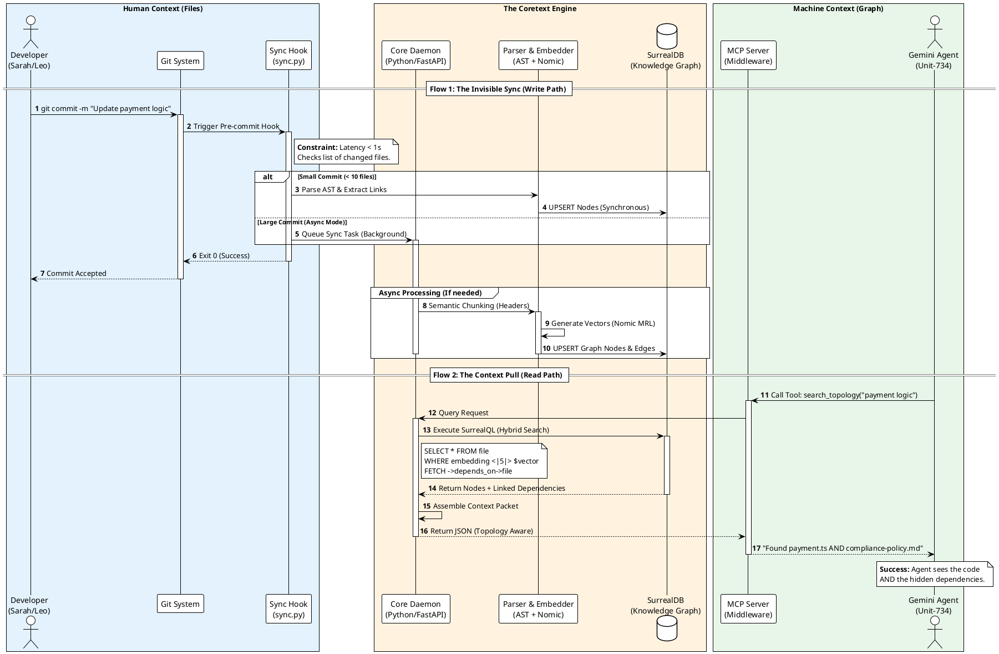
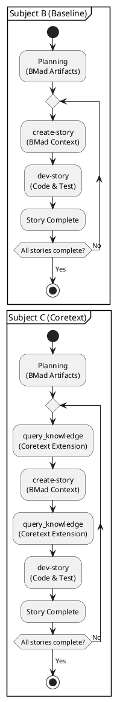

# Abstract

The transition from AI Coding Assistants to Autonomous Software Engineers is currently impeded by a **"Topological Autonomy Gap."** While Large Language Models (LLMs) excel at generating code syntax, they struggle to navigate the complex, interconnected structure of large-scale software specifications, often succumbing to "Context Overload" when processing flat documentation files. This research proposes **Coretext**, a system that transforms unstructured Markdown specifications into a structured **Knowledge Graph**, enabling agents to perform deterministic graph traversal instead of probabilistic search.

Using a Design Science Research (DSR) methodology, we implemented Coretext as a Model Context Protocol (MCP) server backed by **SurrealDB**. We evaluated the system through a comparative case study on a web application project ("Project Trore"). Results indicate that the graph-augmented agent achieved a **5.4% improvement in overall token efficiency** and a **30.6% reduction in input tokens** for complex architectural tasks compared to a file-based baseline. These findings validate that externalizing a project's "Mental Model" into a Machine-Readable State is a foundational requirement for enabling fully autonomous, state-aware software engineering.

## **Chapter I. Introduction**

### **1.1. Problem Statement**

**1.1.1. The Evolution of AI Coding: From IDE Assistants to CLI Agents**

The trajectory of software engineering has been fundamentally reshaped by the migration of AI from passive assistants to autonomous agents.

*   **The Assistant Era (2018–2022):** The revolution began with **Visual Studio IntelliCode (2018)** and accelerated with **GitHub Copilot (2021)**. These tools were "Assistants"—bound to the IDE, waiting for a human to type, and offering local snippets.
*   **The Agentic Shift (2025):** The paradigm shifted decisively with the release of **Claude Code** in early 2025. Unlike its predecessors, Claude Code was not an IDE plugin but a **CLI-Native Agent**. It lived in the terminal, capable of executing shell commands, managing git operations, and orchestrating complex multi-file refactors without human intervention. This marked the birth of the "Headless Developer"—agents like **Gemini CLI** that operate directly on the file system rather than through a text editor view.
*   **The Autonomous Era (2026):** By early 2026, this model had become the industry standard. **Mike Krieger**, Chief Product Officer at Anthropic, confirmed in February 2026 that the company’s internal AI tools were generating effectively **"100 percent"** of their production code. The human engineer's role had irrevocably shifted from writing syntax to defining intent.

**1.1.2. The Rise of Spec-Driven Development**

This shift has given rise to a methodology termed **Spec-Driven Development (SDD)**. In an ecosystem where AI handles the Implementation, the human engineer is responsible solely for the Specification. Documentation—Requirements, User Stories, and Architectural Decision Records (ADRs)—is no longer a passive reference but the active **"Source of Truth"** that drives the agent. The quality of the software now depends entirely on the precision of the specification provided to the autonomous agent.

**1.1.3. The Topological Autonomy Gap: A Three-Layer Failure**

However, a critical Topological Autonomy Gap exists. While CLI agents like Claude Code and Gemini CLI are powerful, they struggle to navigate the complex, interconnected topology of a large-scale project without constant human hand-holding. This failure occurs at three distinct layers:

1. **Model Level (Context Window Overload):** Feeding entire documentation repositories into Large Language Models (LLMs) leads to high token costs and the "Lost in the Middle" phenomenon, where models struggle to retrieve information from the middle of long contexts.  
2. **Tool Level (Flat-File Blindness):** Current tools (search, grep, ls) treat documents and knowledge as **flat, disconnected files**. They fail to capture the semantic and topological relationships (dependencies, references, hierarchies) between requirements, design, and implementation.  
3. **Context Level (The Topological Autonomy Gap):** Even with structured methodologies like **BMad**—which organizes files into Epics and Stories—the system remains **insufficient for full autonomy**. The "Mental Model" of the project (the connections between an Epic and its specific code implementation) remains implicit in the files or the human operator's mind. Without an explicit, machine-navigable state machine, autonomous agents cannot self-direct effectively.

### **1.2. Research Objective**

The primary objective of this research is to resolve the challenge of **"Topological Blindness"**—the inability of current AI agents to perceive the structural relationships within software specifications.

This research posits the hypothesis that **transforming unstructured documentation into a structured Knowledge Graph provides the necessary topological context for autonomous agents to navigate complex architectures without human intervention.**

To validate this hypothesis, this research pursues three specific sub-objectives:

1.  **To Design a Topological Schema for Specifications:** Define a "Schema Projection" strategy that maps flat Markdown artifacts (e.g., *PRDs*, *User Stories*) into a rigorous graph ontology (Nodes and Edges), thereby making the project's "Mental Model" machine-readable.
2.  **To Implement a Structural Retrieval Mechanism:** Develop a retrieval system (via Model Context Protocol) that enables agents to perform **graph traversal** (e.g., *"Find all dependencies of this Epic"*) rather than relying on probabilistic keyword search.
3.  **To Evaluate Context Efficiency:** Quantitatively measure the impact of this graph-based context on the **token efficiency** and **navigational accuracy** of the agent during multi-file development tasks.

The proposed solution, **Coretext**, is integrated into the BMad framework to serve as the experimental validation of this topological approach.

### **1.3. Scope of Research**

The research focuses on the **Specification, Design, and Implementation** phases of the software lifecycle. It specifically targets the transition from file-based specifications (Artifacts) to topological context (Graph Nodes/Edges) to support automated implementation.

### **1.4. Methodology Overview**

This research adopts a **Design Science Research (DSR)** methodology, structured into four distinct phases to ensure a rigorous transition from theoretical model to practical application.

1.  **Phase I: Specification Strategy (Input Generation):** Utilizing the **BMad Method (BMM)** to generate a corpus of structured software specifications (PRDs, Epics, Stories). This phase simulates a "Spec-Driven" environment where human intent is captured in Markdown.
2.  **Phase II: System Design (The Artifact):** Designing and implementing **Coretext**, a parsing engine that transforms these linear Markdown artifacts into a **Knowledge Graph**. This involves defining the graph schema, implementing the AST parser, and establishing the vector embedding pipeline.
3.  **Phase III: Implementation (Agent Integration):** Integrating the Knowledge Graph into the autonomous workflow via the **Model Context Protocol (MCP)**. This phase focuses on the development of the "Structural RAG" mechanism that allows the agent to query the graph.
4.  **Phase IV: Evaluation (Case Studies):** Validating the efficacy of the system through two experiments:
    *   *Experiment 1:* A **Self-Reflexive Validation** study on the Coretext codebase itself.
    *   *Experiment 2:* A comparative analysis using **Project Trore** (a web application) to measure improvements in token efficiency and navigational accuracy against a file-based baseline.

### **1.5. Report Structure**

The remainder of this report is organized as follows:

*   **Chapter II: Theoretical Background** reviews the evolution of AI-driven software development, the limitations of current LLM context windows, and the theoretical foundations of Knowledge Graphs as applied to software engineering.
*   **Chapter III: System Design & Methodology** details the architectural requirements of the Coretext system, the selection of **SurrealDB** as the hybrid data store, and the design of the Schema Projection strategy.
*   **Chapter IV: Implementation** describes the technical realization of the system, including the AST parsing engine, the graph construction logic, and the Model Context Protocol (MCP) integration.
*   **Chapter V: Results & Evaluation** presents the quantitative data derived from the experimental case studies, analyzing metrics such as token efficiency, request count, and navigational accuracy.
*   **Chapter VI: Conclusion** summarizes the research contributions, discusses the implications of the Topological Autonomy Gap, and outlines future directions for fully autonomous software engineering.

## **Chapter II. Theoretical Background & Related Work**

### **2.1. AI-Driven Software Development**

The landscape of software engineering is currently undergoing a "third-wave" transformation, characterized by the transition from **AI Coding Assistants** to **Autonomous Software Engineering Agents**. The first wave (circa 2021–2023) introduced reactive "autocomplete" tools like **GitHub Copilot** and **Tabnine**, which operated primarily as stochastic text predictors within the IDE, reducing keystrokes but lacking broader systemic awareness. The second wave (2024) saw the rise of "Context-Aware Assistants" such as **Cursor** and **JetBrains AI**, which utilized Retrieval-Augmented Generation (RAG) to ground suggestions in local file context. However, these systems remained fundamentally **human-in-the-loop**, requiring constant prompting and supervision for every discrete action.

By 2025, the industry shifted toward **Agentic AI**, defined by systems capable of **proactive** multi-step planning and execution. Unlike their predecessors, agents like **Claude Code**, **Gemini CLI**, and **OpenDevin** operate as "Headless Developers." They are not bound by the editor's active tab but instead interact directly with the operating system—executing shell commands, running test suites, and managing version control operations to achieve high-level objectives (e.g., *"Refactor the authentication module and fix all downstream breakage"*). This shift is quantified by the 2024 Stack Overflow Developer Survey, which noted that while 76% of developers had adopted AI assistants, the integration of fully autonomous agents into CI/CD pipelines represented the emerging frontier of "SDLC-Integrated" engineering.

Despite these advancements, the efficacy of autonomous agents remains non-deterministic when applied to "Brownfield" projects (legacy codebases with complex dependencies). While Large Language Models (LLMs) have scaled to massive context windows (1M+ tokens), simply ingesting raw file dumps often leads to the "Lost in the Middle" phenomenon, where architectural constraints buried in documentation are ignored during code generation. Consequently, the primary challenge in modern AI-driven development has shifted from **Model Capability** (generating syntax) to **Context Management** (retrieving the correct state), a gap this research aims to address.

### **2.2. The Anatomy of a Coding Agent**

To systematically address this gap in context management, we must first deconstruct the operational architecture of a coding agent. We posit that the efficacy of an autonomous developer is not a result of the Large Language Model (LLM) alone, but is an emergent property of three interacting components. We define this relationship via the function:

$$Performance = f(Model, Tools, Context)$$

#### **2.2.1. Model**

The underlying LLM (e.g., GPT, Claude, Gemini).

- **Role:** Logic processing, code generation, and natural language understanding.  
- **Status:** Models such as GPT-5.2, Claude 4.5 Opus, and Gemini 3.0 Pro have achieved state-of-the-art scores on established coding benchmarks (HumanEval, SWE-bench). Critically, their capacity for sustained autonomous reasoning continues to expand with each generation, enabling progressively longer independent work sessions.  
- **Limitation:** The LLM remains a black box whose internal representations are not directly inspectable. This research does not aim to improve the model itself, but rather to optimize the context supplied to it.

#### **2.2.2. Tools**

External Environment Interaction Capability: The ability to run terminal commands, read/write files (File I/O), and browse the web.

1. **IDE-Native Agents**  
   - **Examples:** GitHub Copilot, Cursor, Windsurf, Google Antigravity (Editor View).  
   - *Philosophy:* **Human-in-the-Loop.** Augmenting the active developer in real-time.  
   - *Context Bottleneck:* Highly synchronous and constrained by the "Active Tab and Chat". They excel at micro-level edits and real-time co-piloting, but struggle with macro-architectural consistency and autonomous operation.  
2. **CLI-Driven Agents**  
   - **Examples:** Claude Code, Gemini CLI, Codex CLI.  
   - *Philosophy:* **Headless** **High-Level Logic.** Focusing on file manipulation and refactoring via text-first interfaces, with the same tools humans have.  
   - *Context Bottleneck:* **Session-Bound Memory.** They lack persistence. Once the terminal session closes, the understanding of the project is lost, requiring expensive context re-loading.  
3. **Autonomous Agents**  
   - **Canvas/Product Agents** (e.g., Lovable, v0.dev): Focused on rapid prototype generation.  
     - Limit: Effective for greenfield projects but prone to hallucinating patterns when applied to complex, existing "brownfield" architectures.  
   - **Platform Agents** (e.g., Google Jules, Copilot Workspace): Async issue resolvers living in the repo.  
     - Limit: They act on isolated "Issues" often missing the broader side-effects of their changes on other modules.  
   - **General Purpose Engineers** (e.g., Devin, OpenDevin): Fully autonomous agents.  
     - Limit: High "Discovery Cost." Without a structured map, these agents expend significant tokens and processing time on exploratory file reading to reconstruct the project topology.  
4. **Specialized Agents (Review)**  
   - **Review Agent**  
   - **Examples:** CodeRabbit, Bugbot.  
   - *Philosophy:* Automated review and security checks.

**Summary of Tools:** While these categories show immense progress in *Execution*, they all treat Project Knowledge as a flat, searchable text interface rather than a structured relationship model. This is the **Tool Level** failure: tools are optimized for modifying code, not for understanding the topology of knowledge.

#### **2.2.3. Context**

**Context** represents the essential environmental data supplied to the Model to ground its reasoning and prevent hallucinations. Within an agentic workflow, context is categorized into three fundamental paradigms of retrieval:

1. **Semantic Context:** Relies on probabilistic similarity (Vector Embeddings) to retrieve information that "looks like" the query, excelling at handling unstructured intent.  
2. **Structural Context:** Utilizes deterministic connectivity (Graph/AST) to navigate the project’s topology, ensuring accuracy in dependency mapping and hierarchy.  
3. **Behavioral Context (Agentic Discovery):** Relies on the agent’s autonomy to explore and isolate relevant data in real-time, simulating a human developer’s iterative discovery process.

**The Exploration Gap: Implementation vs. Specification**  
Current industry standards focus heavily on managing **Implementation Context**—the "How" of the codebase (functions, classes, and logic). However, a critical exploration gap exists regarding **Specification Context**—the "Why" behind the code (requirements, user stories, and architectural intent).

While code is treated as a structured entity, documentation is frequently relegated to flat, disconnected text. This research identifies this disconnect as **"Topological Blindness"**. Consequently, a **Knowledge Graph layer** is proposed to bridge this gap, transforming static artifacts into a structured "Machine-Readable State" that allows agents to navigate business logic with the same precision as source code.

### **2.3. Agentic Agile & The BMad Method**

To solve the problem of automated software development, this research uses **BMad** as the process foundation. Specifically, the implementation module **BMM (BMad Method Module)** is utilized to automate the development lifecycle.

#### **2.3.1. The Need for Structured Autonomy**

Conventional coding agent workflows often operate in an ad-hoc, fragmented manner: a user submits a request, the agent executes a fix, and the session terminates. No persistent state is retained between interactions.

When applied to the development of a complete software product, this transactional approach reveals fundamental weaknesses:

- **Lack of overall vision:** The Agent only sees the code, not the product strategy.  
- **Loss of state control:** It is difficult to determine which phase the project occupies (Design or Implementation?).

**BMM** is chosen because it applies the **Agile** mindset to the AI Agent. It forces the Agent to adhere to a strict process: Plans (Sprint) and documents (Specs) must exist before writing Code. This turns the documentation into the single "Source of Truth."

#### **2.3.2. The BMM Implementation**

BMAD is the methodology, while **BMM** is the execution engine that this research applies.

- **Operating Mechanism:** **"Spec-Driven Development"**.  
- Rather than issuing ad-hoc implementation prompts, BMM requires the user and the agent to collaborate on the creation of formal specification documents prior to any code generation.  
- These documents collectively represent the system's persistent **State**.  
- **Role in This Research:** BMM serves as the **Input Generator**. It produces a structured corpus of specification documents (PRDs, Architectures, Stories), providing the raw material from which the Knowledge Graph is constructed.

#### **2.3.3. The Workflow & Limitation**

The operational process of BMM follows an iterative waterfall model within Agile, as described below:

**Phase 1: Initialization and Analysis (Optional)**

- **Goal:** Deciding what to build and why.  
- **Agent:** Analyst  
- **Workflow:** **workflow-init, brainstorm-project, research, product-brief**  
- **Output artifacts:** bmm-workflow-status.yaml (project tracking file), product-brief.md (skipped for this project)

**Phase 2: Planning**

- **Goal:** Transform brief/vision to requirements (Functional/Non-Functional).  
- **Agent:** PM (Product Manager)  
- **Workflow:** **create-prd**  
- **Output artifact:** planning-artifacts/prd.md (Product Requirement Document)

**Phase 3: Solutioning**

- **Goal:** System design to implement from requirement.  
- **Agent:** Architect and Project Manager  
- **Workflow:**  
  - **create-architecture** (Architect): Design system architecture, data schema, tech stack, and Architectural Decision Records (ADRs). **Output artifact:** planning-artifacts/architecture.md  
  - **create-epics-and-stories** (PM): Based on PRD and Architecture, break down the project into Epics and User Stories. **Output artifact:** planning-artifacts/epics.md  
  - **implementation-readiness** (Architect): Check if PRD, Architecture and Epics are aligned before implementation.

**Phase 4: Implementation**

- **Goal:** Transform Stories into code  
- **Agent:** SM (Scrum Master), TEA (Test Architect), Dev (Developer)  
- **Workflow per Epic:**  
  - **sprint-planning** (SM): create tracking file including all Epics and Stories. **Output artifact:** implementation-artifacts/sprint-status.yaml  
  - **test-design** (TEA): design tests for each Epic based on planning artifacts (prd.md, architecture.md, epics.md). **Output artifact:** implementation-artifacts/test-design-epic-\[epic\].md  
  - **Workflow per Story**  
    - **create-story** (SM): **Output artifact:** implementation-artifacts/\[epic\]-\[story\]-\[story name\].md  
    - **dev-story** (Dev): write code, write test, update artifact and status  
    - **code-review** (Dev): review code, fix found issues, complete story  
  - **epic-retrospective** (All Agents): do a retrospective after completing an epic. Output artifact: implementation-artifacts/epic-\[epic\]-retro-\[date\].md

**Figure 2.1** shows the BMad Workflow, illustrating the flow from Vision to Code.

```mermaid
flowchart TB
    %% --- STYLING ---
    classDef workflow fill:#e1f5fe,stroke:#01579b,stroke-width:2px;
    classDef artifact fill:#fff9c4,stroke:#fbc02d,stroke-width:2px,stroke-dasharray: 5 5;
    classDef decision fill:#fce4ec,stroke:#880e4f,stroke-width:2px,shape:rhombus;
    classDef other fill:#f5f5f5,stroke:#616161,stroke-width:1px,stroke-dasharray: 3 3;
    classDef endstate fill:#000,stroke:#000,stroke-width:2px,color:#fff,shape:circle;

    %% --- PHASE 1: INIT ---
    subgraph P1 ["Phase 1: Analysis"]
        direction TB
        W_Init([workflow-init]):::workflow
        W_Brief([product-brief]):::workflow
        A_Status[bmm-workflow-status.yaml]:::artifact
        A_Brief[product-brief.md]:::artifact
        
        W_Init --> A_Status
        W_Init --> W_Brief
        W_Brief --> A_Brief
    end

    %% --- PHASE 2: PLANNING ---
    subgraph P2 ["Phase 2: Planning"]
        direction TB
        W_PRD([create-prd]):::workflow
        A_PRD[prd.md]:::artifact
        W_PRD --> A_PRD
    end

    %% --- PHASE 3: SOLUTION ---
    subgraph P3 ["Phase 3: Solutioning"]
        direction TB
        W_Arch([create-architecture]):::workflow
        A_Arch[architecture.md]:::artifact
        W_Epics([create-epics]):::workflow
        A_Epics[epics.md]:::artifact
        Check_Ready{Ready?}:::decision

        W_Arch --> A_Arch
        A_Arch --> W_Epics
        W_Epics --> A_Epics
        A_Epics --> Check_Ready
        Check_Ready -- No --> W_Arch
    end

    %% --- PHASE 4: IMPL (NESTED LOOPS) ---
    subgraph P4 ["Phase 4: Implementation Loops"]
        direction TB
        
        %% 1. EPIC START
        W_SprintPlan([sprint-planning]):::workflow
        A_Sprint[sprint-status.yaml]:::artifact
        W_TestDes([test-design]):::workflow
        A_Test[test-design.md]:::artifact

        %% 2. STORY LOOP
        subgraph StoryLoop ["Story Execution Loop"]
            direction TB
            W_CreateStory([create-story]):::workflow
            A_Story[Story.md]:::artifact
            W_Dev([dev-story]):::workflow
            W_Review([code-review]):::workflow
            Check_MoreStories{Next Story?}:::decision

            W_CreateStory --> A_Story
            A_Story --> W_Dev
            W_Dev --> W_Review
            W_Review -- Fix --> W_Dev
            W_Review -- OK --> Check_MoreStories
            
            %% LOOP BACK FOR STORY
            Check_MoreStories -- Yes --> W_CreateStory
        end

        %% 3. EPIC END
        W_Retro([epic-retrospective]):::workflow
        A_Retro[epic-retro.md]:::artifact
        Check_MoreEpics{Next Epic?}:::decision

        %% WIRING P4 INTERNALS
        W_SprintPlan --> A_Sprint --> W_TestDes --> A_Test --> W_CreateStory
        Check_MoreStories -- No --> W_Retro
        W_Retro --> A_Retro --> Check_MoreEpics
        
        %% LOOP BACK FOR EPIC
        Check_MoreEpics -- Yes --> W_SprintPlan
    end
    
    Finish((Done)):::endstate

    %% --- EXCEPTIONS ---
    subgraph POther ["Exceptions"]
        W_Party(party-mode):::other
        W_Quick(quick-dev):::other
        W_Correct(correct-course):::other
        A_Change[change-proposal.md]:::artifact
        W_Correct --> A_Change
    end

    %% --- MAIN CONNECTIONS ---
    A_Brief --> W_PRD
    A_PRD --> W_Arch
    Check_Ready -- Yes --> W_SprintPlan
    Check_MoreEpics -- No --> Finish
    
    %% Layout Helper
    P3 ~~~ POther
```



**The Scalability Barrier: From "Assisted" to "Autonomous"**

While the BMAD workflow combined with CLI-driven agents has proven effective for assisted development, it encounters significant theoretical and operational barriers when scaling toward fully autonomous systems. This represents the **Context Level** failure:

1. **The Human Dependency:** Current agents operate as "workers" rather than "managers." They rely on the human operator to maintain the project's "Mental Model"—manually selecting the correct workflow to route the agent. The system lacks an intrinsic mechanism to self-navigate the correct agent/workflow without human pointing.  
2. **The Limitation of Linear Ingestion:** To compensate for the lack of structural understanding, the standard approach often involves feeding entire documentation artifact into the Context Window ("Context Dumping"). This leads to the "Lost in the Middle" phenomenon and high token costs. Furthermore, flat documentation files are **stateless**; an autonomous agent cannot easily query the *status* of an Epic or the *impact* of a change without parsing the entire repository text repeatedly.

**Conclusion:** To transition from Human-in-the-Loop (Assisted) to Human-on-the-Loop (Autonomous), the system requires a **"Machine-Readable State"**. This necessitates moving from a document-centric storage (flat files) to a knowledge-centric architecture (Graph).

### **2.4. Knowledge Graph Theory**

Software engineering artifacts exhibit a naturally high degree of connectivity. Unlike generic text corpora, code and specifications are defined by their relationships (dependencies, inheritance, references). Therefore, a Knowledge Graph (KG) offers a more isomorphic representation of software projects than flat text or vector stores.

#### **2.4.1. The Property Graph Model**

This research utilizes the **Labeled Property Graph** model (implemented via SurrealDB). This model is characterized by:

- **Nodes (Vertices):** Represent discrete software artifacts. In our context, these include DocumentNode (files), SectionNode (headers/requirements), and CodeNode (functions/classes).  
- **Edges (Relationships):** Represent directed dependencies. Crucial relationships include Contains (File \-\> Header), Parent\_of (Header \-\> Header) and REFERENCES (File \-\> File).  
- **Properties:** Key-value pairs stored within nodes and edges (e.g., status, last\_modified, content\_hash), allowing for rich metadata filtering during traversal.

#### **2.4.2. Comparative Analysis: Vector Search vs. Graph Traversal**

To justify the architectural choice, we compare the dominant retrieval method (Vector RAG) with the proposed Graph approach:

| Feature        | Vector Search (Semantic RAG)                                                                             | Knowledge Graph (Structural RAG)                                                       |
| :------------- | :------------------------------------------------------------------------------------------------------- | :------------------------------------------------------------------------------------- |
| **Mechanism**  | Probabilistic Similarity (Embeddings)                                                                    | Deterministic Connectivity (Edges)                                                     |
| **Query Type** | *"Find code that looks like login logic"*                                                                | *"Find the exact User Story linked to this Function"*                                  |
| **Strength**   | Fuzzy matching, handling unstructured intent.                                                            | Traceability, Dependency mapping, Impact analysis.                                     |
| **Weakness**   | **Context Flattening:** Loses the hierarchical structure; prone to hallucinations when concepts overlap. | **Construction Cost:** Requires strict parsing and maintenance of the graph structure. |

While Vector Search is superior for "Discovery" (finding unknown items), Knowledge Graph is essential for "Navigation" (understanding complex systems). This research aims to leverage the deterministic nature of Graphs to reduce the hallucination rate in coding tasks.

#### **2.4.3. Graph Retrieval-Augmented Generation (GraphRAG)**

GraphRAG represents the synthesis of LLM reasoning and Graph topology. In this proposed framework, the workflow shifts from linear reading to recursive traversal:

1. **Extraction:** The LLM or Parser identifies entities in the user prompt (e.g., "AuthService").  
2. **Traversal:** The system queries the Graph to retrieve the "Sub-graph" (1-hop or 2-hop neighbors) connected to that entity.  
3. **Generation:** The Agent receives a highly curated context containing only the relevant logical cluster, filtering out noise.

This approach transforms the documentation from a static repository into a **dynamic cognitive map**, allowing the Agent to "reason" about the project structure before writing code.

### **2.5. Related Work**

#### **2.5.1. Category I: Hybrid Semantic Retrieval**

*   **Representative Systems:** Cursor, GitHub Copilot (IDE), Windsurf.
*   **Mechanism:** These systems employ a **Hybrid Search** strategy, combining **Sparse Retrieval** (keywords via BM25/Splade) with **Dense Retrieval** (vector embeddings). They typically index the codebase by "chunking" files into snippets and storing them in a local Vector Store (e.g., Cursor's "Shadow Workspace").
*   **Strength:** Highly effective for **Implementation Queries** (e.g., *"How do I implement a search bar?"*) where the intent is fuzzy and the answer is local.
*   **Limitation:** This approach suffers from **Structural Hallucination**. While it can retrieve code that *resembles* a requested feature, it fails to understand the causal chain between modules. Crucially, it treats Markdown documentation as flat text, losing the hierarchical context of Epics and Stories.

#### **2.5.2. Category II: Static Analysis & LSP Integration**

*   **Representative Systems:** Sourcegraph Cody, Google Cider.
*   **Mechanism:** These tools leverage the **Language Server Protocol (LSP)** and **SCIP** (Stack Graphs) to build precise Dependency Graphs (*Definition* → *Reference*). They enable "deterministic navigation," allowing an agent to follow function calls across files with zero error.
*   **Strength:** Provides absolute precision for **Code Refactoring** and cross-file symbol resolution.
*   **Limitation (The Doc-Code Disconnect):** This method is strictly limited to **Rigid Syntax** (code). It breaks down when confronting **Unstructured Artifacts** (documentation). An LSP cannot resolve a reference from a textual User Story to a Python function, leaving the business logic disconnected from the implementation.

#### **2.5.3. Category III: Agentic Tool-Use & Just-in-Time Retrieval**

*   **Representative Systems:** Claude Code, Gemini CLI, OpenDevin.
*   **Core Philosophy:** No pre-indexing. The Agent explores the environment dynamically, much like a human developer.
*   **Mechanism 1: Progressive Disclosure:**
    *   Starts with a **Metadata Layer** (File tree, `ls -R`).
    *   Performs **Surgical Reading** (detailed content access) only when necessary using tools (`grep`, `cat`, `view`).
*   **Mechanism 2: Context Isolation:**
    *   The Agent plans autonomously, breaking large tasks into sub-tasks.
    *   Each sub-task creates an isolated context session to prevent "Context Pollution."
*   **Mechanism 3: ARCS (Agentic Retrieval-Augmented Code Synthesis):**
    *   **Logic:** The Agent does not merely retrieve context *before* coding. It generates code, executes it, encounters an error, and then **re-retrieves based on that error**.
    *   **Significance:** This marks the transition from a "Static Reader" to a "Dynamic Experimenter."
*   **Strength:** No indexing overhead. High reasoning capability.
*   **Limitation:**
    *   **Cold Start:** Without high-quality cues (like a perfectly written `CLAUDE.md` or `README.md`), the Agent wastes numerous steps (and tokens) figuring the project structure.
    *   **Manual Dependency:** Still relies on humans to manually draft context files to feed the context for business logic comprehension.

**Gemini CLI**, and other CLI-driven agents, represent Category III, optimizing execution through ReAct loops and robust CLI tools.

### **2.6. The Research Gap**

While the approaches described above have advanced the state of automated coding, they share a common deficiency: **"Topological Blindness."**

1.  **Structural Dissonance:** Existing tools treat Code as a graph (AST/LSP) but treat Specifications (PRDs) as flat text, creating an impedance mismatch.
2.  **The Missing Bridge:** There is no automated mechanism to explicitly link a **Business Node** (e.g., a Requirement) to an **Execution Node** (e.g., a Unit Test).
3.  **The Topological Autonomy Gap:** Consequently, agents are forced to rely on "Context Dumping"—reading entire documents—to infer relationships that should be explicit. This research identifies this gap as the primary barrier to fully autonomous development, necessitating the creation of a specialized **Knowledge Graph for Documentation**.

## **Chapter III. System Design & Methodology**

### **3.1. Research Methodology Overview**

This research follows a **Design Science Research (DSR)** methodology, characterized by a **self-reflexive bootstrapping approach**. Unlike traditional linear workflows, the construction of the artifact (Coretext) was performed using the very methodology it aims to augment (BMad), thereby serving as both the implementation phase and the primary heuristic evaluation.

The research process is structured into four phases:

1.  **Phase I: Foundation & Framework Selection:** Identifying the need for topological awareness and selecting the **BMad Method** as the baseline "Spec-Driven" workflow. This provided the necessary structured input (Epics/Stories) to begin development.
2.  **Phase II: Recursive Construction (Experiment 1):** Implementing the Coretext system *using* the standard BMad workflow. This "Bootstrapping" phase yielded primarily **qualitative insights**. It validated the baseline process while exposing specific process bottlenecks (e.g., context fragmentation) that the topological graph could theoretically resolve.
3.  **Phase III: Artifact Refinement:** Formalizing the qualitative findings from Phase II into the final **Coretext MCP Architecture**, hardening the schema, and finalizing the graph traversal logic.
4.  **Phase IV: Comparative Evaluation (Experiment 2):** Conducting a controlled comparative study on an external "Brownfield" project (**Project Trore**). This phase focused on **quantitative metrics** (token efficiency, request count) to measure improvement. It also provided **qualitative validation** that the graph-augmented workflow produces code of equivalent quality to the baseline, while highlighting persistent shared challenges that form the basis for future work.

**Figure 3.1** illustrates the Recursive Bootstrapping process and the Comparative Evaluation setup.



### **3.2. Requirements Analysis**

The system requirements were derived using the BMad planning workflow, decomposing the high-level objective of "Topological Autonomy" into specific functional and non-functional constraints.

#### **3.2.1. Functional Requirements (FR)**

The functional requirements focus on the four key operational domains: Graph Construction, Synchronization, Agent Retrieval, and Developer Tooling.

| ID       | Requirement Description                                                                                | Category           |
| :------- | :----------------------------------------------------------------------------------------------------- | :----------------- |
| **FR1**  | The system can parse Markdown files into a structured Knowledge Graph (Nodes/Edges).                   | Graph Construction |
| **FR2**  | The system can detect changes in Markdown files within a Git repository.                               | Synchronization    |
| **FR3**  | The system can synchronize detected file changes into the Knowledge Graph.                             | Synchronization    |
| **FR4**  | The system can store the Knowledge Graph in a local SurrealDB instance.                                | Storage            |
| **FR5**  | The system can version the Graph state based on Git commit hashes.                                     | Synchronization    |
| **FR6**  | The system can enforce referential integrity (validating links between nodes).                         | Integrity          |
| **FR7**  | The system can detect and report malformed Markdown syntax.                                            | Integrity          |
| **FR8**  | The system can output a text-based dependency tree for a given node.                                   | Tooling            |
| **FR9**  | The system can receive context queries from an AI Agent via an MCP Server.                             | Agent Interface    |
| **FR10** | The system can retrieve topologically relevant context based on vector similarity and graph traversal. | Retrieval          |
| **FR11** | The system can provide retrieved context to the AI Agent via standard MCP protocols.                   | Agent Interface    |
| **FR12** | The system can traverse specific graph relationships (e.g., `depends_on`, `child_of`).                 | Retrieval          |
| **FR13** | The system can integrate as a pre-commit Git hook.                                                     | Synchronization    |
| **FR14** | The system can execute synchronization during `git commit` operations.                                 | Synchronization    |
| **FR15** | The system can run a "dry-run" integrity check before commit.                                          | Integrity          |
| **FR16** | The system can provide a CLI for initialization (`init`) and management.                               | Tooling            |
| **FR17** | The system can provide a CLI for viewing service status (`status`).                                    | Tooling            |
| **FR18** | The system can provide a CLI for linting graph integrity (`lint`).                                     | Tooling            |
| **FR19** | The system can provide structured templates for creating new specifications.                           | Tooling            |
| **FR20** | The system can complete incremental sync within defined time limits.                                   | Performance        |
| **FR21** | The system can perform asynchronous background sync for large commits.                                 | Performance        |
| **FR22** | The system can respond to Agent context queries within defined latency limits.                         | Performance        |
| **FR23** | The system can operate within defined memory consumption limits.                                       | Performance        |
| **FR24** | The system can perform background processing with low CPU priority.                                    | Performance        |

#### **3.2.2. Non-Functional Requirements (NFR)**

To ensure the system remains unobtrusive in a local development environment, strict performance and resource constraints were established.

| Metric               | Target                    | Rationale                                                                           |
| :------------------- | :------------------------ | :---------------------------------------------------------------------------------- |
| **Sync Latency**     | < 1 second                | Pre-commit hooks must not block the developer's "flow state."                       |
| **Query Latency**    | < 500 ms (RTT)            | Agent "thinking" time must remain fluid; slow retrieval causes context timeouts.    |
| **Scalability**      | 10,000 files / 100k edges | Must support large-scale enterprise repositories without degradation.               |
| **Memory Footprint** | < 100 MB (Idle)           | The daemon runs locally; it cannot consume resources needed by the IDE or Compiler. |
| **Reliability**      | "Fail-Open" Policy        | If the tool crashes, it must **not** prevent the user from committing code.         |
| **Security**         | Local-First / No Cloud    | All data (Vectors/Graph) must reside on `localhost` to ensure privacy.              |

### **3.3. System Architecture**

To address the requirements defined above, **Coretext** is architected as a decoupled, local-first system comprising four distinct layers. This design ensures separation of concerns between user interaction, agent communication, and data persistence.

**Figure 3.2** presents the C4 Container Diagram, highlighting the interactions between the Developer, the CLI, the Coretext System, and the local Git repository.

```plantuml
@startuml
!include https://raw.githubusercontent.com/plantuml-stdlib/C4-PlantUML/master/C4_Container.puml

' LAYOUT_TOP_DOWN()
LAYOUT_LEFT_RIGHT()

title C4 Container Diagram for Coretext System (Current Implementation)

Person(developer, "Developer (Human)", "Author of Markdown specs (BMAD) and code.")
System_Ext(local_git, "Local Git Repository", "Source of Truth. Triggers hooks on commit.")

System_Boundary(c1, "Coretext System") {
    
    Container(cli_tool, "Coretext CLI", "Python / Typer", "User interface. Runs 'init', 'start'. Manages the SurrealDB process.")
    
    Container(sync_engine, "Sync Engine (Transient)", "Python Script", "Spawned by Git Hook. Parses Markdown AST, diffs changes, and writes to DB. Exits after sync.")
    
    ContainerDb(surrealdb, "SurrealDB Daemon", "SurrealDB Binary", "The 'Daemon' (PID: .Coretext/daemon.pid). Long-running. Stores the Graph & Vectors. Accessed via WebSocket.")
}

Rel(developer, local_git, "1. git commit")
Rel(developer, cli_tool, "Runs commands")

Rel(cli_tool, surrealdb, "Starts/Monitors (writes daemon.pid)")

Rel_R(local_git, sync_engine, "2. Post-Commit Hook triggers Sync")
Rel_U(sync_engine, local_git, "3. Reads staged/committed files")

Rel(sync_engine, surrealdb, "4. Pushes Nodes/Edges (SurrealQL)", "WebSocket")

note right of sync_engine
  <b>Current Architecture:</b>
  - No Python Daemon (yet)
  - Sync driven by Git Hooks
  - SurrealDB is the only daemon
end note

@enduml
```

#### **3.3.1. High-Level Design**

The system architecture is organized into the following components:

1.  **Client Layer (CLI & Agent):**
    *   **CLI (`typer`):** The primary interface for human developers. It handles system lifecycle management (`init`, `start`, `stop`) and provides direct introspection tools (`inspect`, `lint`).
    *   **Gemini Extension:** A thin compatibility layer that exposes the system's capabilities to the Gemini CLI ecosystem via the Model Context Protocol (MCP).

2.  **Server Layer (MCP Daemon):**
    *   A lightweight **FastAPI** server running as a background daemon.
    *   It exposes standardized MCP endpoints (e.g., `/mcp/tools/search_topology`) that abstract complex graph queries into simple function calls.
    *   This layer acts as the "Gateway," protecting the core logic from direct external access.

3.  **Core Layer (The "Brain"):**
    *   **Parser Module:** Responsible for transforming raw Markdown text into Abstract Syntax Trees (AST) and normalizing file paths.
    *   **Graph Manager:** The central gatekeeper for all state changes. It orchestrates the logic for node creation, edge linking, and vector embedding generation.
    *   **Sync Engine:** An event-driven module that listens for file system changes via Git hooks and triggers incremental updates.

4.  **Storage Layer (SurrealDB):**
    *   A multi-model database (Graph + Document + Vector) running as a local binary.
    *   It serves as the unified persistence layer, allowing for complex "Hybrid Queries" that combine semantic vector search with deterministic graph traversal.

**Figure 3.3** shows the operational activity flow across the four system layers during a synchronization event.



#### **3.3.2. Data Architecture: Schema Projection**

A critical architectural challenge was bridging the gap between the flexibility of Markdown (unstructured text) and the rigidity of a database schema. To solve this, the system implements a **"Schema Projection"** strategy:

*   **Internal Schema (The Ideal State):** The system defines a rigid internal ontology using **Pydantic** models (e.g., `class Epic(BaseNode)`). This ensures that the code always operates on strongly typed data structures.
*   **Mapping Layer (The Translator):** A configuration file (`schema_map.yaml`) defines the projection rules, mapping external Markdown headers (e.g., `# User Story`) to internal database properties.
*   **Projection:** During ingestion, the **Parser Module** reads the Markdown, applies the mapping rules, and "projects" the unstructured content into the rigid Pydantic models before persistence. This decouples the database schema from the document format, allowing the documentation style to evolve without breaking the system.

**Figure 3.4** illustrates the Coretext Graph Data Model, detailing the node types, relationships, and inheritance structure.



### **3.4. Technology Selection & Justification**

The technological foundation of **Coretext** was selected based on strict adherence to the "Local-First" and "Agent-Native" architectural constraints. The following decision matrix summarizes the critical technology choices.

| Requirement             | Evaluated Options                       | Selected Technology              | Rationale for Selection                                                                                                                                                                                                                                                     |
| :---------------------- | :-------------------------------------- | :------------------------------- | :-------------------------------------------------------------------------------------------------------------------------------------------------------------------------------------------------------------------------------------------------------------------------- |
| **Graph Database**      | Neo4j, ArangoDB, SurrealDB              | **SurrealDB**                    | **Multi-Model Efficiency:** Unifies Graph, Document, and Vector stores in a single binary. Neo4j handles vectors poorly; ArangoDB lacks the same developer ergonomics for embedded use. SurrealDB runs as a single lightweight binary (~50MB), crucial for local execution. |
| **Vector Model**        | OpenAI-Embed, Gemini-Embed, Nomic-Embed | **Nomic-Embed-Text-v1.5**        | **Local Matryoshka Representation Learning (MRL):** Supports dynamic truncation of embeddings without retraining. This allows the system to balance storage cost vs. precision. Crucially, it runs locally on CPU (ONNX), eliminating cloud dependencies.                   |
| **Agent Orchestration** | Github Copilot, Claude Code, Gemini CLI | **Gemini CLI**                   | **Long Context & Caching:** Gemini 3.0 Pro supports 1M+ tokens with context caching, essential for "bootstrapping" the graph from large documentation sets. It provides a native CLI interface that aligns with the "Headless Developer" paradigm.                          |
| **Input Format**        | JSON, YAML, Markdown                    | **Markdown**                     | **Human-AI Isomorphism:** Markdown is the only format that is equally readable by humans (for creativity) and agents (for parsing). Its header structure (`#`, `##`) maps naturally to graph hierarchy (`PARENT_OF`), serving as a "pre-graph" format.                      |
| **Interface Protocol**  | REST, GraphQL, MCP                      | **Model Context Protocol (MCP)** | **Universal Compatibility:** MCP standardizes the connection between AI models and data sources. By implementing an MCP server, Coretext becomes "plug-and-play" for any compliant agent (Claude, Gemini), avoiding vendor lock-in.                                         |

#### **3.4.1. Database Layer: SurrealDB**

In the overall architecture, rather than attempting to ingest the entire codebase into the database, Coretext focuses exclusively on **Project Knowledge**—the specification layer.

**Strategic Data Segregation: Code vs. Knowledge**

Unlike other approaches trying to turn the whole Codebase into a graph, this project clearly separates the roles of 2 different data types:

1. **Code (Implementation Layer):**  
   - **Characteristics:** Deterministic, frequently changing, and strictly structured (Syntax).  
   - **Strategy:** Use **Agentic Tool-Use Retrieval**. Real-time CLI tools, grep, or AST parsers handle code searches far more efficiently than storing them in a Graph Database.  
2. **Knowledge (Specification Layer):**  
   - **Characteristics:** Unstructured or semi-structured text (Markdown), containing design intent, business logic, and semantic relations.  
   - **Strategy:** This is the primary subject for a **Knowledge Graph**. These must be converted from static files into dynamic graph nodes so the Agent can query the context.

**Conclusion:** The database is designed specifically for storing the **Mental Model** of the project (Epics, Stories, PRDs), acting as a Reference Layer for the Agent during interaction with Code.

**Comparative Analysis: Why not Neo4j?**

After evaluating popular solutions such as Neo4j (Pure Graph) or Qdrant/Chroma (Pure Vector), this research opts for **SurrealDB**.

**Multi-model Architecture:** Managing software documentation requires the convergence of three critical elements:

1. **Document Store:** Storing raw text (Markdown content) for Agent comprehension.  
2. **Graph Store:** Storing reference links to understand project structure.  
3. **Vector Store:** Storing embeddings for semantic search.

SurrealDB natively supports all three models within a single entity (Record), eliminating the need to maintain multiple disparate databases and reducing **Architectural Complexity**.

While Neo4j is the industry standard for Graph Databases, applying it to "Agentic Context" problems reveals significant **Architectural Impedance Mismatch**:

| Feature Criteria     | Neo4j (Traditional Graph)                                                                                          | SurrealDB (Selected)                                                                                                     |
| :------------------- | :----------------------------------------------------------------------------------------------------------------- | :----------------------------------------------------------------------------------------------------------------------- |
| **Document Storage** | **Weak.** Storing large text bodies (Markdown) in Node properties degrades performance and complicates management. | **Native.** Each Record acts as both a graph Node and a complete JSON Document. Ideal for Markdown files.                |
| **Vector Search**    | Requires plugins (Graph Data Science Lib) or complex configurations for Vector Index integration.                  | **Native.** Supports Vector Embeddings and distance functions (Cosine/Euclidean) directly in the database core.          |
| **Deployment**       | Heavy (Java-based); resource-intensive for local execution (Local-first constraint).                               | **Ultra-lightweight.** Single binary written in Rust. Perfectly fits Coretext’s "Local-First" and CLI tool architecture. |
| **Query Complexity** | Cypher is powerful for graphs but cumbersome when combining Full-text and Vector search.                           | **SurrealQL** allows combining all three query types in a single, simple SQL-like statement.                             |

**Conclusion:** Selecting SurrealDB eliminates the need to maintain two separate databases (Graph + Vector), reducing **Operational Complexity** by an estimated 50%. This choice prioritizes architectural fitness for the specific use case over adherence to established industry defaults.

**The Power of SurrealQL: A Unified Query Language**

The core strength of Coretext lies in its **Hybrid Retrieval** capability. The Agent does not need to execute multiple disjointed steps (e.g., querying a Vector DB for IDs, then a Graph DB for relationships). Instead, SurrealQL enables highly sophisticated compound queries:

**Mechanism:** A convergence of **Semantic Search** (Vector-based meaning), **Graph Traversal** (Relationship-based scope), and **Lexical Search** (Keyword-based matching).

**Theoretical Application:** Rather than merely searching for *similar* text fragments (Pure Vector), the system empowers the Agent to perform high-order logical queries:

*"Find business rules regarding 'Dual finding' (**Semantic**) BUT only within the scope of 'Search Story' (**Graph Topology**) AND containing the keyword 'SurrealDB' as the designated platform (**Lexical**)."*

This ensures that the context provided to the Agent is both semantically relevant and structurally accurate. This query mechanism precisely mirrors the "Mental Model" and cognitive process of a software engineer.

#### **3.4.2. Orchestration Layer: Gemini CLI & Model Ecosystem**

In an Agentic architecture, the choice of execution tool (Orchestration Interface) is as critical as the choice of the Model itself. Rather than building a chat system from scratch, this research integrates **Gemini CLI**—a powerful open-source tool by Google—to serve as the entry point for programming tasks.

**The Reasoning Engine: Gemini 3.0**

The system utilizes the **Gemini 3.0** model family (released Q4/2025) as the primary Reasoning Engine. This choice is based on superior characteristics compared to contemporary rivals (such as GPT-5.2 or Claude 4.5):

- **Native Long Context (1M+ Tokens):** The ability to process massive context windows allows the Agent to grasp the entire graph structure when necessary.  
- **Adaptive Reasoning:** The capability to automatically switch between *Flash* (fast responses for simple queries) and *Pro* (deep reasoning for complex architectural tasks) modes, optimizing both latency and cost.  
- **Multi-modal Capabilities**

**Context Caching Strategy**

One of the greatest hurdles in Agentic Development is the token cost of repeatedly loading large project documents. Gemini CLI addresses this via **Context Caching** technology:

- **Mechanism:** Instead of re-sending the entire document content in every chat turn, the system caches the state on Google's servers.  
- **Impact:** Reduces input token costs by **90%** for repetitive queries. This transforms "chatting with the entire project" from a luxury into an economically viable solution for this research.

**Open Source**

Unlike proprietary closed-source tools such as *Cursor* or *Claude Code*, Gemini CLI is **Open Source**. This is a decisive factor for the scientific integrity of this research:

- **Transparent Logging:** Enables the export of full conversation histories, token usage, and model metadata. This is vital for quantitatively measuring Knowledge Graph efficiency.  
- **Reproducibility:** Any researcher can replicate the experimental environment without dependency on a specific paid IDE (though a dependency on Google's models remains).

**Extensibility via Model Context Protocol (MCP)**

Gemini CLI supports the **MCP (Model Context Protocol)** standard, allowing standardized connections to external tools.

- **Integration:** Coretext operates as an **MCP Server Extension**.  
- **Workflow:** When a user asks, *"Which files are affected by this User Story?"*, Gemini CLI invokes the query\_knowledge tool via the MCP protocol to retrieve precise data from SurrealDB.

**Architectural Divergence: Overcoming Execution Bias**

A critical analysis reveals a distinct philosophical gap between **Gemini CLI** and industry standards like **Claude Code**.

- **The Standard Approach (Claude Code):** Adopts a **"Plan-First"** architecture. It enforces a rigid internal state machine (*Plan to Review to Execute*), treating coding as a systematic industrial process. While safe, this introduces significant latency.  
- **The Gemini Approach (Execution Bias):** Optimized for **"Low-Friction"** and massive context ingestion. Without external guidance, the model exhibits a tendency toward over-confidence, frequently bypassing the planning phase to proceed directly to implementation—a pattern that may be termed "unstructured generation." This leads to frequent architectural oversimplifications in complex projects.

**Research Adaptation:** This research identifies that Gemini's execution bias constitutes an **architectural advantage** when paired with an externalized knowledge base. Rather than relying on the model to maintain an internal plan—which introduces what we term "Prose Interference"—**Coretext** externalizes the "State Management" to the Graph.

#### **3.4.3. Input Artifacts: The Strategic Choice of Markdown**

In the AI era, selecting a document format is no longer just a matter of preference; it is a critical **Architectural Decision**. This research adopts **Markdown** as the primary format for storing knowledge (Knowledge Artifacts).

**The Optimal Human-AI Integration**

Software development documentation must serve two distinct audiences: **Humans** (for comprehension and creativity) and **AI Agents** (for analysis and code generation). Markdown represents the optimal equilibrium that other formats fail to achieve:

| Format                  | Human Readability | AI Readability          | Disadvantages in Agentic Workflow                                                                                                                 |
| :---------------------- | :---------------- | :---------------------- | :------------------------------------------------------------------------------------------------------------------------------------------------ |
| **Docx / PDF / LaTeX**  | High (Visual)     | Low / Medium            | Contains excessive presentation metadata (layout, fonts). AI wastes tokens processing formatting "noise" without understanding logical structure. |
| **JSON / YAML / XML**   | Low (Cluttered)   | High (Strict Structure) | Difficult for long-form human writing. Unsuitable for drafting business descriptions (User Stories) or design thinking.                           |
| **Markdown (Selected)** | **High**          | **High**                | Lightweight syntax. AI easily identifies structure through symbols like \#, \*, and \> without being distracted by noise.                         |

**Markdown as a Pre-Graph Structure**

Markdown is more than just flat text. With modern extensions (as seen in Obsidian or BMAD), Markdown possesses inherent pre-graph characteristics:

- **Links:** These function as **Reference edges** connecting different nodes.  
- **Headers (\# H1 \-\> \#\# H2):** Represent natural **Parent\_of** and **Contains** relationships.  
- **Frontmatter (YAML header):** Contains metadata, effectively serving as **Node Properties**.

**Conclusion:** Using Markdown allows the system to transition into a **Knowledge Graph (SurrealDB)** naturally, without requiring users to learn complex data entry tools.

## **Chapter IV. Implementation**

### **4.1. Development Process**

To manage the complexity of the Coretext system, the implementation was decomposed into **5 Epics** and **29 User Stories**, strictly adhering to the BMad "Spec-Driven" methodology described in Chapter II.

*   **Epic:** A high-level architectural milestone representing a complete feature set (e.g., "Core Knowledge Graph Foundation").
*   **Story:** An atomic implementation unit with verifiable acceptance criteria, ensuring granular progress and testing.

The development lifecycle for each story followed the specific **BMad Implementation Workflow**:

1.  **Context Construction (`create-story`):** The workflow analyzes the Epic and Architecture to generate a specific **Story Artifact** (e.g., `1-3-bmad-markdown-parsing.md`). This document serves as the "micro-spec," containing the precise prompt and acceptance criteria for the implementation.
2.  **Development (`dev-story`):** This workflow executes the implementation in a self-contained loop that includes:
    *   **Test Generation:** Writing unit tests based on the acceptance criteria.
    *   **Coding:** Implementing the feature logic.
    *   **Validation:** Running tests to ensure the implementation passes the specific requirements.
3.  **Review (`code-review`):** This workflow analyzes the changes for architectural compliance and potential bugs. This step is iterative; the workflow is triggered multiple times to resolve issues before the story is marked as complete.

**Figure 4.1** depicts the iterative Implementation Workflow, detailing the cycle from Story creation to verification.



The complete execution roadmap is detailed below:

| Epic       | Focus               | Implemented Stories                                                                                                                                                                                                                                                            |
| :--------- | :------------------ | :----------------------------------------------------------------------------------------------------------------------------------------------------------------------------------------------------------------------------------------------------------------------------- |
| **Epic 1** | **Core Foundation** | 1.1 Project Initialization & Core Scaffolding, 1.2 SurrealDB Management & Schema Application, 1.3 BMad Markdown Parsing to Graph Nodes, 1.4 Git Repository Change Detection & Synchronization, 1.5 Referential Integrity Link Validation, 1.6 Epic 1 Demo & Verification Fixes |
| **Epic 2** | **Agent Retrieval** | 2.1 MCP Server Setup & Health Check, 2.2 Semantic Tool for Topology Search, 2.3 Semantic Tool for Dependency Retrieval, 2.4 MCP Protocol Adherence & Documentation, 2.5 Epic 2 Demo & Verification Fixes                                                                       |
| **Epic 3** | **Developer Tools** | 3.1 CLI for Init & Daemon Management, 3.2 CLI for Status, 3.3 CLI for Inspect Node Dependency Tree, 3.4 CLI for Lint Graph Integrity Check, 3.5 BMad Template Provisioning, 3.6 Epic 3 Demo & Verification Fixes                                                               |
| **Epic 4** | **Reliability**     | 4.1 Git Hook Async Mode & Fail-Open Policy, 4.2 MCP Query Latency Optimization, 4.3 Resource Consumption Management, 4.4 Graph Self-Healing Integrity Checks, 4.5 Epic 4 Stress Testing & Verification, 4.6 Epic 4 Demo & Verification Fixes                                   |
| **Epic 5** | **Release & Gaps**  | 5.1 Comprehensive Product Demo Verification Guide, 5.2 Directory Selection Feature, 5.3 Hybrid Execution Thick Tool, 5.4 Extension Packaging & Verification, 5.5 End-to-End Dogfooding Demo, 5.6 Extension Manifest & Command Packaging                                        |

The following sections (§4.2–4.7) detail the technical realization of these stories.

### **4.2. Parsing Engine (AST & Normalization)**

The parsing engine, implemented in **Epic 1**, serves as the system's ingestion layer. It is responsible for transforming the unstructured Markdown syntax into a rigorous, machine-readable graph topology, satisfying **Requirement FR1**.

#### **4.2.1. Abstract Syntax Tree (AST) Generation**
To avoid the fragility inherent in regex-based parsing, the system utilizes **markdown-it-py** to tokenize input files.
*   **Mechanism:** The parser consumes raw text and produces a linear stream of AST tokens (e.g., `heading_open`, `inline`, `heading_close`).
*   **Benefit:** This approach correctly handles nested structures and code blocks, ensuring that headers within code snippets are ignored rather than erroneously creating graph nodes.

#### **4.2.2. Node Extraction & Schema Projection**
The `MarkdownParser` class iterates through the AST stream, applying the **Schema Projection** logic defined in §3.3.2.
*   **Header-to-Node Mapping:** Every heading token (`h1` through `h6`) initiates the creation of a `SectionNode`. The content following a header is aggregated and assigned as the `content` property of that node.
*   **Link Extraction:** Inline link tokens are extracted and converted into `Reference` objects. These are not stored as text but as provisional edge definitions awaiting validation.

#### **4.2.3. Path Normalization Strategy**
A critical implementation challenge addressed in **Story 1.3** was ensuring referential uniqueness across a distributed file system. The `PathNormalizer` component resolves this by converting all variable file paths into **Canonical IDs**.
*   **Problem:** A file might be referenced as `./doc.md`, `../docs/doc.md`, or `/abs/path/to/doc.md`. Treating these as distinct nodes would fracture the graph.
*   **Solution:** All paths are resolved relative to the project root (detected via markers like `.git` or `pyproject.toml`). The Canonical ID is defined as the POSIX-style relative path from the root (e.g., `docs/report.md`), ensuring that every node has a deterministic, unique primary key regardless of the caller's working directory.

### **4.3. Knowledge Graph Construction**

Following the parsing phase, the `GraphManager` component orchestrates the deterministic construction of the Knowledge Graph within SurrealDB. This implementation satisfies **Requirement FR4 (Graph Storage)** and was iteratively refined across **Story 1.2** and **Story 1.5**.

#### **4.3.1. Graph Ontology**
The graph schema is defined using rigid **Pydantic** models to ensure type safety before database insertion. The ontology consists of two primary node types and three relationship types:

*   **Nodes:**
    *   `DocumentNode`: Represents a physical Markdown file. Properties include `file_path`, `checksum`, and `last_modified`.
    *   `SectionNode`: Represents a logical section (header). Properties include `header_text`, `level`, and the `vector_embedding` of its content.
*   **Edges:**
    *   `CONTAINS`: A structural edge linking a `DocumentNode` to its top-level `SectionNodes`.
    *   `PARENT_OF`: A hierarchical edge representing the document outline (e.g., `H1` → `H2`).
    *   `REFERENCES`: A semantic edge representing a hyperlink between two distinct nodes, enabling the traversal of logical dependencies.

#### **4.3.2. Idempotent Upsert Strategy**
To support the "Fail-Open" synchronization requirement (**FR13**), the graph construction logic is designed to be **idempotent**. The system employs a batched `MERGE` strategy rather than simple `INSERT` statements to minimize database round-trips:
1.  **Resolution:** The Canonical ID (e.g., `doc:docs/report.md`) is calculated.
2.  **Transaction:** A database transaction is opened using `BEGIN TRANSACTION` to ensure atomicity.
3.  **Upsert:** If the node exists, its content and checksum are updated; if not, it is created.
4.  **Edge Pruning:** Stale edges (links that were removed in the text) are identified and deleted to maintain graph hygiene.

#### **4.3.3. Handling Recursive Dependencies**
A specific challenge encountered during **Epic 1** was handling cyclic references (File A links to File B, which links back to A). The system implements a **Lazy Edge Creation** mechanism: `REFERENCES` edges are committed only *after* all nodes in the current batch have been successfully upserted. This prevents "Foreign Key" violations where an edge attempts to link to a node that has not yet been created in the current transaction.

### **4.4. Semantic Retrieval (Hybrid Search)**

To bridge the gap between unstructured agent queries and structured graph data, the system implements a **Hybrid Retrieval Engine**. This component was initially developed in **Epic 2** (Story 2.2) to establish the vector foundation and significantly enhanced in **Epic 5** (Story 5.3) to support complex filtering and traversal.

#### **4.4.1. Local Vector Embedding Pipeline (Story 2.2)**
Coretext implements a fully local, privacy-preserving embedding pipeline using `sentence-transformers`.
*   **Model:** The system utilizes **nomic-embed-text-v1.5** with `trust_remote_code=True` to generate high-quality text embeddings.
*   **Indexing:** To ensure sub-500ms retrieval latency (**FR22**), the system defines an **HNSW** (Hierarchical Navigable Small World) index on the `embedding` field of all nodes, configured with `DIMENSION 768` in SurrealDB.
*   **Matryoshka Slicing:** The `VectorEmbedder` class supports variable-dimension truncation, allowing the system to trade off precision for storage efficiency, though the default is maintained at 768 for maximum accuracy.

#### **4.4.2. The "Thick Tool" Abstraction (Story 5.3)**
While early versions exposed granular tools like `search_topology`, **Epic 5** introduced the `query_knowledge` "Thick Tool" to encapsulate the entire retrieval logic. This tool implements a sophisticated "Vector-First" execution strategy:

1.  **Anchor Identification:** The system executes a SurrealQL query using `vector::distance()` to find the `top_k` nearest nodes to the query embedding.
2.  **Dynamic Filtering:** The query dynamically appends `WHERE` clauses to filter anchors *before* traversal.
    *   **Regex Filtering:** Uses the SurrealQL `~` operator (e.g., `file_path ~ "^/src/.*"`) to scope searches to specific directories.
    *   **Keyword Filtering:** Uses the `CONTAINS` operator for strict lexical matching.
3.  **Graph Traversal:** From the filtered anchors, the `GraphManager` iteratively queries edge tables (`CONTAINS`, `PARENT_OF`, `REFERENCES`) to expand the context up to the requested `depth`.
4.  **Consolidation:** The resulting subgraph is deduplicated and serialized, providing the Agent with a unified context object that includes both the semantic match and its structural dependencies.

### **4.5. Synchronization Mechanism**

To maintain the "Machine-Readable State" without disrupting the developer's workflow, Coretext implements an event-driven synchronization engine. This system, established in **Epic 1** and optimized in **Epic 4**, operates invisibly via Git Hooks.

#### **4.5.1. The Dual-Hook Strategy (Story 1.4)**
The system installs two distinct hooks into the user's `.git/hooks/` directory, each serving a specific phase of the commit lifecycle:

1.  **Pre-commit Hook (Validation Phase):** Executes in **"Dry-Run Mode"**.
    *   **Action:** Triggers the Parsing Engine (§4.2) to scan staged files for syntax errors and broken links ("Dangling References").
    *   **Policy:** **Blocking**. If errors are found, the commit is aborted, enforcing strict data quality before it enters the repository history.
2.  **Post-commit Hook (Synchronization Phase):** Executes in **"Write Mode"**.
    *   **Action:** Detects the file diff from `HEAD` using `gitpython` and triggers the `GraphManager` (§4.3) to upsert changes to SurrealDB.
    *   **Policy:** **Fail-Open**. If the database is unreachable or the sync crashes, the error is logged to `.Coretext/Coretext.log`, but the commit remains successful. This ensures the tool never holds the user's code hostage.

#### **4.5.2. Asynchronous Detachment (Story 4.1)**
To satisfy the sub-second latency requirement (**FR20**), the `SyncEngine` implements a dynamic execution strategy.
*   **Threshold Check:** Before execution, the engine counts the number of changed files.
*   **Detachment:** If the count exceeds `SYNC_ASYNC_THRESHOLD_FILES` (default: 5), the process immediately detaches using `subprocess.Popen`, spawning a background daemon to handle the heavy lifting.
*   **User Feedback:** The CLI prints a non-blocking notification: `[Coretext] Large commit detected. Syncing in background...`, allowing the developer to return to their terminal instantly.

### **4.6. MCP Integration**

To expose the Knowledge Graph to autonomous agents without vendor lock-in, the system implements the **Model Context Protocol (MCP)** server. This interface layer, developed in **Epic 2**, transforms the internal Python logic into a standardized, machine-consumable API.

#### **4.6.1. The FastAPI Middleware (Story 2.1)**
The server is built on **FastAPI**, serving as a middleware that wraps the `GraphManager` operations.
*   **Security Guardrail:** To enforce the local-first policy, the server implements a strict middleware check in `Coretext/server/health.py` that rejects any request not originating from `127.0.0.1`.
*   **Route Pattern:** Tools are exposed via the `/mcp/tools/{tool_name}` pattern. For example, the `search_topology` tool is accessible at `POST /mcp/tools/search_topology`.

#### **4.6.2. Automated Manifest Generation (Story 2.4)**
A core innovation in the implementation was the **dynamic generation of the MCP Manifest**. Instead of manually maintaining a JSON schema file, the system utilizes Python introspection:
1.  **Inspection:** The `ManifestGenerator` scans all registered FastAPI routes.
2.  **Schema Extraction:** It extracts the input parameters from the associated **Pydantic** models.
3.  **Docstring Parsing:** It parses the Google-style docstrings of the handler functions to generate tool descriptions and usage examples.
This ensures that the "Agent Instructions" (the API documentation) remain perfectly synchronized with the code implementation, eliminating "documentation drift."

**Figure 4.2** shows the Sequence Flow, detailing how the Human and the Agent interacts with the Files and Graph via Coretext.



### **4.7. CLI Interface**

The Developer Experience (DX) is mediated through a command-line interface built with **Typer** and **Rich**. This component, finalized in **Epic 3**, provides the human control plane for the system, offering a comprehensive suite of tools for lifecycle management, graph maintenance, and introspection.

#### **4.7.1. Lifecycle Management (Story 3.1)**
The `Coretext` command abstracts the complexity of the dual-process architecture (Database + Server).
*   **Initialization (`init`):** Bootstraps the local environment by downloading the platform-specific SurrealDB binary and the `nomic-embed-text` model to a global cache (`~/.Coretext/cache`), minimizing disk usage. It also provisions the project-local `.Coretext/config.yaml`.
*   **Daemon Orchestration (`start`/`stop`):** Spawns and manages the SurrealDB database and the FastAPI MCP server as background processes. State is tracked via `daemon.pid` and `server.pid` files to ensure clean termination and prevent port conflicts.
*   **Health Checks (`status`/`ping`):** Provides real-time visibility into system health by pinging the daemon's internal endpoints and verifying database connectivity.

#### **4.7.2. Graph Management & Synchronization**
To maintain the integrity of the Knowledge Graph, the CLI offers explicit control over the indexing process:
*   **Manual Sync (`sync`):** Triggers an immediate, recursive parse of a specified directory, updating the graph without waiting for git commits.
*   **Hook Installation (`install-hooks`):** Deploys the event-driven git hooks (`pre-commit`, `post-commit`) described in §4.5 into the repository's `.git/hooks/` directory.
*   **Schema Enforcement (`apply-schema`):** Force-applies the Pydantic-defined graph ontology to the database, ensuring the schema remains synchronized with the codebase.
*   **Reset (`wipe`):** A destructive utility for clearing all graph data, useful during development iterations.

#### **4.7.3. Introspection & Analysis Tools**
To support the "Glass Box" philosophy, the CLI provides tools for developers to visualize and verify the system state:
*   **Visual Inspection (`inspect`):** Renders the dependency tree of a specific node as a formatted ASCII hierarchy in the terminal, allowing developers to verify relationships (e.g., `parent_of`, `references`) at a glance.
*   **Hybrid Query (`query`):** Exposes the full power of the "Thick Tool" (§4.4.2) to the developer, enabling testing of vector search, regex filtering, and graph traversal directly from the command line.
*   **Quality Assurance (`lint`):** Triggers the parsing engine in "Dry-Run" mode to detect and report "Dangling References" and syntax errors with precise line numbers.
*   **Scaffolding (`new`):** Generates new specification documents from standardized BMAD templates (e.g., Stories, Epics), ensuring that new artifacts are pre-compliant with the graph schema.

### **4.8. Gemini CLI Extension**

To satisfy **Requirement FR9 (Agent Integration)**, Coretext is packaged as a native extension for the Gemini CLI. This integration bridges the gap between the human developer's terminal and the autonomous agent's reasoning loop.

#### **4.8.1. The Stdio Adapter Architecture (Story 5.6)**
A critical interoperability challenge arose from the protocol mismatch between the Coretext Daemon (HTTP/Server-Sent Events) and the Gemini CLI's extension interface (Stdio JSON-RPC). To resolve this, an **Adapter Layer** was implemented in `Coretext/cli/adapter.py`.
*   **Bridge Function:** The adapter runs as a subprocess of the Gemini CLI. It reads JSON-RPC messages from `stdin`, proxies them as HTTP requests to the local daemon (e.g., `POST /mcp/tools/call`), and writes the responses back to `stdout`.
*   **Lifecycle Coupling:** The adapter includes "Auto-Start" logic. If the daemon is not running when the agent attempts a query, the adapter silently spawns the background processes, ensuring zero-friction availability.

#### **4.8.2. Manifest and Command Packaging**
The extension is defined by a `gemini-extension.json` manifest located at the project root.
*   **Portable Configuration:** The manifest utilizes the `${extensionPath}` variable to correctly reference the Python entry point regardless of the installation directory.
*   **Custom Prompts:** A suite of TOML-based commands (e.g., `commands/Coretext-status.toml`) injects specialized system prompts into the CLI. This allows users to invoke complex Coretext workflows (like `lint`, `sync`, or `status`) using natural language shortcuts, effectively wrapping the CLI tools described in §4.7 for agentic use.

#### **4.8.3. Exposed MCP Tools**
Through this extension, the Gemini Agent gains access to the "Thick Tools" running on the daemon:
*   **`search_topology`:** For pure semantic discovery of nodes.
*   **`get_dependencies`:** For deep structural analysis of node relationships.
*   **`query_knowledge`:** The universal retrieval engine for performing hybrid context queries in a single turn.

## **Chapter V. Results and Evaluation**

### **5.1. Experiment 1: Self-Reflexive Case Study (Project Coretext)**

This initial experiment involved bootstrapping the Coretext system itself using the standard BMad workflow. The objective was twofold: first, to evaluate the efficiency of the baseline "Spec-Driven" process (Human + CLI Agent) across the entire project lifecycle; and second, to identify specific integration failures in the early stages (Epic 1) that necessitated a topological solution.

#### **5.1.1. Overall Process Evaluation: The Efficacy of Structure**
The bootstrapping of the complete system (Epics 1–5) using the standard BMad workflow yielded a **notably high level of efficiency**. Contrary to the assumption that an agent without a graph would struggle with a complex multi-process architecture (CLI, Daemon, Database), the strict hierarchical structure of the specifications (Epics → Stories) allowed the human operator to act as an effective "Semantic Router."

**Key Observation:**
By manually feeding isolated specification files to the agent, token waste was minimized. This confirms that **structured specification is a critical enabler**: current coding agents can manage complex logic effectively when the context is curated by a human operator. However, this "Human-in-the-Loop" dependency revealed critical limitations during integration phases.

#### **5.1.2. The Integration Ceiling (Epic 1 Retrospective)**
While the construction phase was efficient, the integration phase of Epic 1 revealed the "Topological Autonomy Gap." The retrospective analysis highlighted two specific failure modes where the baseline process broke down:

1.  **The "Lost in the Middle" Phenomenon:** The agent successfully implemented Stories 1.2 (DB Config) and 1.4 (Sync Logic) in isolation, achieving passing unit tests ("Green State"). However, end-to-end verification failed because the agent missed the implicit runtime dependency between the components—a connection lost when the files were processed sequentially rather than topologically.
2.  **Knowledge Inertia (Version Drift):** Despite having access to SurrealDB 2.0 documentation, the agent persistently hallucinated deprecated SurrealQL 1.x syntax. The static file context was insufficient to override the model's training bias, a friction point that required repeated manual intervention to resolve.

### **5.2. Experiment 2: Application Case Study (Project Trore)**

#### **5.2.1. Overview of Evaluation Method**

To evaluate the system in a real-world scenario, we conducted a comparative experiment on **Project Trore**, a rental listing platform built with React 19, FastAPI, and Supabase. The test focused on Epic 1 (Core Scaffolding & Data Modeling), which contains five specific User Stories (1-1 to 1-5).

**The Isolation Strategy:**
We compared two agents to see if the graph could replace the need to read full documentation files.

-   **Baseline Agent (Subject B):** Could read all documentation files (PRD, Architecture, Epics) directly.
-   **Coretext Agent (Subject C):** Was **blocked** from reading the documentation files. It had to use the Coretext tools (`query_knowledge`, `get_dependencies`) to find the information it needed from the graph.

**Figure 5.1** illustrates the workflow differences between the two subjects.



The objective was to measure whether the Agent could build complex features relying solely on the Knowledge Graph for context.

#### **5.2.2. Evaluation Metrics**

We measured performance using four metrics:

1.  **Input Token Volume (ITV):** The total text sent to the AI. Lower is better (saves cost and memory).
2.  **Context Utility (Tokens / LOC):** How many tokens it took to write one line of code. A lower number means the AI was more efficient.
3.  **Request Count:** How many times the AI had to "think" or run a command.
4.  **Referential Integrity:** Whether the links in the documentation were valid (measured by the `Coretext lint` tool).

#### **5.2.3. Analysis of Results - Story by Story**

**Story 1-1**

| Metric                | Subject B (File-Based) | Subject C (Coretext) | Delta (%)   |
| :-------------------- | :--------------------- | :------------------- | :---------- |
| Total Requests        | 87                     | 72                   | \-17.2%     |
| Input Tokens (Total)  | 306,443                | 227,384              | \-25.8%     |
| Output Tokens (Total) | 13,910                 | 11,650               | \-16.2%     |
| LOC                   | 612                    | 532                  | \-13.1%     |
| **Tokens / LOC**      | **523.5**              | **449.3**            | **\-14.2%** |

**Observation:** In the initial scaffolding phase, the Coretext Agent used **25.8% fewer tokens** than the baseline. Instead of reading the entire Product Requirement Document (PRD), it simply queried the graph for the specific folder structure and naming rules. This shows that for setting up a project, the agent does not need to read the full narrative if it can access specific structural details.

**Story 1-2**

| Metric                | Subject B (File-Based) | Subject C (Coretext) | Delta (%)    |
| :-------------------- | :--------------------- | :------------------- | :----------- |
| Total Requests        | 82                     | 25                   | \-69.5%      |
| Input Tokens (Total)  | 309,951                | 253,777              | \-18.1%      |
| Output Tokens (Total) | 12,868                 | 5,032                | \-60.9%      |
| LOC                   | 549                    | 120                  | \-78.1%      |
| **Tokens / LOC**      | **588.0**              | **2,156.7**          | **\+266.8%** |

**Observation:** The Coretext Agent reduced the total request count by **69.5%**, leveraging the `query_knowledge` tool to retrieve only the relevant database schema definitions while filtering out unrelated architectural details. However, the referential integrity enforcement mechanism prevented the agent from completing the task until it resolved broken cross-references detected in the documentation. This result indicates that the graph imposes stricter data quality constraints than conventional flat-file workflows.

**Story 1-3**

| Metric                | Subject B (File-Based) | Subject C (Coretext) | Delta (%)   |
| :-------------------- | :--------------------- | :------------------- | :---------- |
| Total Requests        | 65                     | 66                   | \+1.5%      |
| Input Tokens (Total)  | 241,692                | 392,436              | \+62.4%     |
| Output Tokens (Total) | 11,954                 | 13,454               | \+12.5%     |
| LOC                   | 451                    | 487                  | \+8.0%      |
| **Tokens / LOC**      | **562.4**              | **833.4**            | **\+48.2%** |

**Observation:** Token efficiency declined in this story, with a 62.4% increase in input token consumption. The agent encountered difficulty formulating effective search queries to locate specific service boundary definitions within the graph. In contrast to the baseline agent—which could access the relevant file directly—the Coretext Agent was required to perform multiple iterative searches to establish its navigational context. This finding suggests that when the agent lacks precise search terminology, graph-based retrieval can incur higher costs than direct linear file access.

**Story 1-4**

| Metric                | Subject B (File-Based) | Subject C (Coretext) | Delta (%)  |
| :-------------------- | :--------------------- | :------------------- | :--------- |
| Total Requests        | 64                     | 78                   | \+21.9%    |
| Input Tokens (Total)  | 253,637                | 281,110              | \+10.8%    |
| Output Tokens (Total) | 10,713                 | 13,708               | \+28.0%    |
| LOC                   | 359                    | 435                  | \+21.2%    |
| **Tokens / LOC**      | **736.4**              | **677.7**            | **\-8.0%** |

**Observation:** The Coretext Agent required a higher request count (+21.9%) yet maintained marginally superior efficiency per line of code (-8.0%). Notably, the `lint` tool identified path reference errors that the baseline agent failed to detect. The Coretext Agent was required to perform additional corrective steps to resolve these errors, resulting in improved documentation quality at the cost of increased total processing time.

**Story 1-5**

| Metric                | Subject B (File-Based) | Subject C (Coretext) | Delta (%)   |
| :-------------------- | :--------------------- | :------------------- | :---------- |
| Total Requests        | 61                     | 54                   | \-11.5%     |
| Input Tokens (Total)  | 392,928                | 272,790              | \-30.6%     |
| Output Tokens (Total) | 18,875                 | 17,144               | \-9.2%      |
| LOC                   | 370                    | 768                  | \+107.6%    |
| **Tokens / LOC**      | **1,113.0**            | **377.5**            | **\-66.1%** |

**Observation:** This story showed the clearest benefit of the system. The Coretext Agent generated twice as much code as the baseline but used **30.6% fewer tokens**. Because the graph was fully populated by this stage, the agent could retrieve the exact business rules it needed without re-reading the entire project history. This indicates that the graph approach becomes significantly more efficient as the project grows larger.

**Epic 1 Summary: Cumulative Efficiency**

| Subject                | Total Input Tokens | Total Output Tokens | Total Requests | LOC   | Tokens / LOC (Avg) | Efficiency Gain |
| :--------------------- | :----------------- | :------------------ | :------------- | :---- | :----------------- | :-------------- |
| Subject B (File-Based) | 1,504,651          | 68,320              | 359            | 2,341 | 671.9              | \-              |
| Subject C (Coretext)   | 1,427,497          | 60,988              | 295            | 2,342 | 635.6              | **\-5.4%**      |

**Conclusion of Experiment 2:**
Overall, the Coretext Agent demonstrated better efficiency than the file-based baseline:

-   **17.8% fewer requests** (295 vs 359)
-   **5.1% fewer input tokens** (1,427,497 vs 1,504,651)
-   **10.7% fewer output tokens** (60,988 vs 68,320)
-   **5.4% better token efficiency** (635.6 vs 671.9 tokens/LOC)

The 5.4% efficiency gain indicates that the Coretext Agent consumed fewer tokens to produce an equivalent volume of code. The system delivered its greatest advantage in complex, dependency-heavy tasks where targeted subgraph retrieval eliminated the need for exhaustive file reading. Conversely, the regressions observed in Story 1-3 demonstrated that when the graph index is incomplete or the agent lacks precise search terminology, graph-based retrieval can incur higher costs than direct linear file access.

### **5.3. Discussion**

The experimental results from Project Trore corroborate the theoretical framework established in Chapter II: externalizing the project's topological structure into a Knowledge Graph fundamentally alters the agent's retrieval behavior and yields measurable efficiency improvements.

#### **5.3.1. Resolving the "Missing Mental Model"**
As established in the problem statement (§1.1.3), current AI agents suffer from "Topological Blindness"—the inability to perceive the structural relationships that bind specifications to implementation. The results from Story 1-5, where the Coretext Agent consumed **30.6% fewer input tokens** than the baseline, demonstrate that the Knowledge Graph effectively provides this missing structural awareness. By transitioning the retrieval paradigm from linear file ingestion to targeted subgraph traversal, the agent bypassed irrelevant context and retrieved only the logically connected nodes required for the task. This evidence supports the conclusion that a structured topological representation serves as an effective substitute for exhaustive document processing.

#### **5.3.2. The Synchronization Bottleneck**
However, the regression observed in Story 1-3 exposed a previously unaddressed constraint: **temporal consistency**. The efficacy of graph-based retrieval is contingent upon the graph accurately reflecting the current state of the documentation. When a developer modifies a specification file but the synchronization pipeline has not yet propagated the change to SurrealDB, the agent operates on a stale representation. This temporal mismatch introduces erroneous traversal results—the agent may follow edges to nodes whose content has been altered or removed. This finding indicates that synchronization latency is not merely a performance concern but a **correctness constraint** that must be satisfied for the topological approach to remain reliable.

#### **5.3.3. Data Quality as an Emergent Constraint**
An unanticipated benefit of the graph-augmented workflow was the enforcement of documentation quality. In Story 1-2, the agent was unable to complete its implementation until it resolved broken cross-references detected by the `lint` tool. In conventional file-based workflows, malformed hyperlinks in documentation artifacts typically persist undetected, as no automated mechanism validates referential integrity. Within the graph-driven workflow, however, a broken reference constitutes a severed edge—a structural defect that directly impairs the agent's ability to traverse dependencies. This constraint imposes a higher standard of documentation hygiene, requiring that specification authors maintain valid cross-references as a prerequisite for effective autonomous navigation.

### **5.4. Threats to Validity**

While the results are promising, several threats to validity must be acknowledged to contextualize the findings.

#### **5.4.1. Small Sample Size**
The evaluation is limited to two projects (Coretext and Trore) and a single development Epic (Epic 1). While the "Zero-File" constraint provided rigorous isolation, the sample size of 29 User Stories is insufficient to claim statistical significance across all software domains. The efficiency gains observed in "Brownfield" refactoring may not translate to "Greenfield" creative tasks where topological structure is yet to be defined.

#### **5.4.2. Tool Maturity and Stability**
The reliance on **SurrealDB 2.0** (a beta release at the time of writing) introduced confounding variables. The "Version Drift" issues noted in §5.1 suggest that some friction points were due to the underlying database tool rather than the Knowledge Graph methodology itself. Additionally, the evaluation was conducted exclusively using **Gemini 3.0 Pro**. As performance is a function of $f(Model, Tool, Context)$, it is unknown if more capable models (e.g., the recently release Claude Opus 4.6) would derive the same benefit or if they would overcome "Topological Blindness" through raw context window power alone.

#### **5.4.3. Path Portability in Distributed Teams**
A critical technical limitation identified is the handling of file paths. The current implementation relies on a "Canonical ID" system rooted in the local file system. This creates a "Local-First" bias. In a distributed team environment, where absolute paths vary between machines, the graph's referential integrity could fracture, potentially negating the observed efficiency gains.

#### **5.4.4. Author-as-Evaluator Bias**
Finally, Experiment 1 utilizes a self-reflexive "Bootstrapping" method where the author of the system also served as the human operator. While the "Zero-File" constraint in Experiment 2 was designed to mitigate this, the selection of the *Coretext* repository as a test subject inherently biases the results, as the system was optimized for its own structure. Future studies requires blind evaluation by independent developers to validate generalizability.

## **Chapter VI. Conclusion and Future Works**

### **6.1. Conclusion**

This research set out to validate the hypothesis that **transforming unstructured documentation into a structured Knowledge Graph provides the necessary topological context for autonomous agents to navigate complex architectures.** The results confirm that this transformation effectively resolves the "Topological Blindness" inherent in file-based AI workflows, shifting the paradigm from Document-Centric to **Knowledge-Centric** development.

The experimental evaluation yielded two critical insights:

1.  **Structure Reduces Cognitive Load:** In the Project Trore case study (Experiment 2), the graph-augmented agent demonstrated a **5.4% improvement in overall token efficiency** compared to the file-based baseline. More significantly, in complex architectural tasks (Story 1-5), the system reduced input token consumption by **30.6%**, proving that targeted subgraph retrieval prevents the "Context Overload" that plagues standard RAG approaches.
2.  **Navigation Requires Precision:** The self-reflexive study (Experiment 1) revealed that while "Structure is Key," it must be current. The agent successfully navigated the codebase using the graph but struggled when synchronization latency led to a "stale map," highlighting that **Synchronization Speed** is as critical as Retrieval Accuracy.

Ultimately, the findings from both experiments demonstrate that for an Agent to transition from *Assisted* to *Autonomous*, it must operate upon a **Machine-Readable State**. By externalizing the "Mental Model" of the project into a traversable graph, we enable agents to reason about the "Why" (Specification) with the same deterministic precision they apply to the "How" (Code).

### **6.2. Future Work**

While the current system has achieved its primary utility goals, the path to fully autonomous software engineering requires addressing specific technical limitations identified during the "Dogfooding" phase.

#### **6.2.1. Immediate Optimization (Technical Debt)**
To support enterprise-scale repositories (>10,000 files), the following architectural optimizations are prioritized:

*   **Vector Efficiency:** Implementing **Matryoshka Representation Learning (MRL)** to reduce embedding dimensions (from 768 to 128) and **Batch Encoding** to accelerate ingestion, addressing the 25-second sync latency observed in Experiment 1.
*   **Search Latency:** Shifting from Python-based graph traversal to **Native SurrealQL Traversal**, executing complex dependency lookups entirely within the database kernel to minimize round-trip time.
*   **Resilience:** Implementing **Incremental Indexing** based on file modification times (`mtime`) and **Resilient Ingestion** to prevent partial parse failures from blocking the entire synchronization pipeline.
*   **Portability:** Resolving the "Local-First" bias by enforcing **Project-Relative Paths** in the graph schema, enabling the Knowledge Graph to be shared across distributed teams without breaking referential integrity.

#### **6.2.2. Long-Term Vision: The Native State Machine**
Beyond optimization, the research proposes a three-phase evolution for the Coretext architecture:

1.  **Phase 1 (Achieved):** Coretext functions as a **Utility**, offering structural retrieval commands to human developers.
2.  **Phase 2 (Current):** Coretext acts as a **Driver** for existing agent frameworks (BMad), injecting precise context via MCP.
3.  **Phase 3 (Vision):** Coretext evolves into the **Native State Machine** for Multi-Agent Systems. In this phase, the system will ingest not only documentation but the *process definitions* themselves (workflows, rules). This internalization of the methodology will allow the Knowledge Graph to dynamically orchestrate specialized agents, achieving a clean separation between the "Strategy" (Graph) and the "Execution" (Agent).

This evolution suggests that the future of AI-driven development lies not in larger context windows, but in more intelligent context topology—constructing systems that encode the project structure so the model does not need to reconstruct it from raw text.