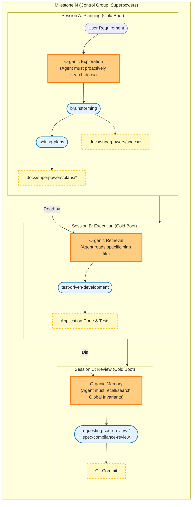
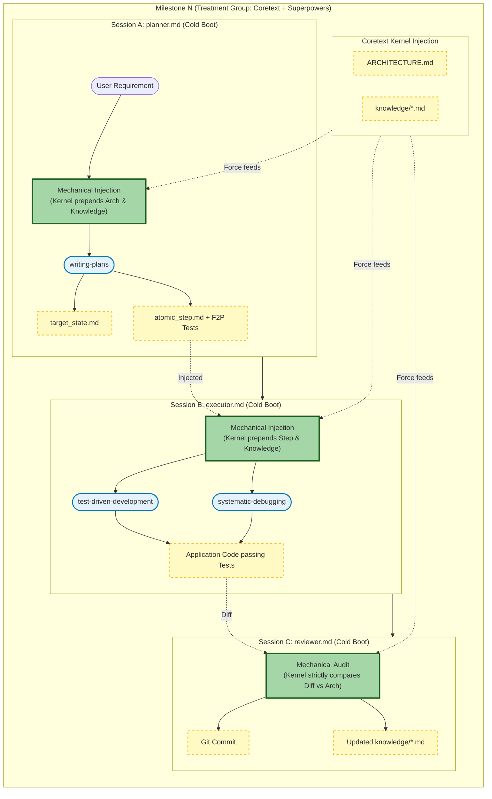

# Experimental Design: Superpowers vs. Superpowers + Coretext v2 (D-SDD)

**Objective:** To empirically prove that while prompt-based frameworks (Superpowers) excel at initial code generation, they inevitably succumb to structural erosion and constraint amnesia over long-horizon tasks. We hypothesize that embedding Superpowers within Coretext v2's Deterministic State-Driven Development (D-SDD) "Operating System" will mathematically halt this degradation by enforcing mechanical architectural boundaries and explicit state transfers between cold-booted agent sessions.

---

## 1. Theoretical Foundations (The 5 Benchmarks)

This experiment abandons the flawed "snapshot-based" evaluation paradigm in favor of a continuous, evolutionary benchmark. Our methodology is directly synthesized from five recent breakthroughs in AI software engineering evaluation:

1.  **SlopCodeBench (arxiv:2603.24755):** We adopt the **Iterative Trajectory** model. The agent is forced to extend its *own prior code* across 5 checkpoints. We measure **Structural Erosion** (complexity concentrating in God Components) and **Verbosity** (redundant code) as the primary indicators of framework failure.
2.  **ProjDevBench (arxiv:2602.01655):** We adopt the **Strict Constraint / Black-Box** model. The problem specifies *only* the external behavior and absolute global invariants (e.g., "URL-state only"). We do not prescribe internal React component structures, forcing the agent to make (and live with) its own architectural decisions.
3.  **SWE-CI (arxiv:2603.03823):** We adopt the concept of **Maintainability via Evolution**. We will calculate an **EvoScore** for the final output, weighting the success of later milestones (Checkpoints 4 & 5) higher than the initial MVP to penalize technical debt accumulation.
4.  **EvoClaw (arxiv:2603.13428):** We adopt the **Develop-in-place, evaluate-in-isolation** pipeline. Each milestone operates on the persistent Git state of the previous one. We measure the divergence between **Recall** (ability to add the new map view) and **Precision** (preventing the regression of the previous URL filter logic).
5.  **Interaction Smells (arxiv:2603.09701v2):** We use this taxonomy as our qualitative penalty ledger. Specifically, we will track **Must-Do Omission** and **Must-Not Violate** events (e.g., when Superpowers forgets the global URL constraint and uses `useState`).

---

## 2. Experimental Setup & Constraints

To ensure absolute scientific validity, both the Control and Treatment groups must operate under an identical environment. The *only* independent variable is the framework's mechanism for managing context across isolated sessions.

### Shared Constraints (The "Fairness" Rules)

1.  **Identical Starting State:** Both experiments begin with an empty Git repository containing only boilerplate code (e.g., an empty Vite/React app) and a root `ARCHITECTURE.md` file pre-seeded with the Global Invariants from `checkpoints.md`.
2.  **Identical Iteration Lifecycle (The 3-Phase Wipe):** To prevent the Control group from suffering an artificial disadvantage due to longer single-session context bloat, both frameworks must undergo three hard context wipes per milestone:
    *   **Session A (Planning Phase):** Agent receives the `User Requirement` and drafts the plan. *Context wiped.*
    *   **Session B (Execution Phase):** Agent writes the code to implement the plan. *Context wiped.*
    *   **Session C (Review Phase):** Agent reviews the git diff against the Global Invariants. *Context wiped.*
3.  **Identical Underlying LLM and Harness:** Both groups must use the exact same LLM model `Gemini 3.1 Pro Preview` and the exact same terminal harness `Gemini CLI` to rule out base-model and harness variance
4.  **Zero Human Intervention (Post-Kickoff):** The human operator acts strictly as a dumb proxy. The operator may only copy outputs to the next session or run standard CLI commands (like `npm run test` or `git commit`) as explicitly requested by the agent. No manual fixing of code, hinting, or correcting hallucinated paths.
5.  **Unmodified Framework Primitives:** The core Superpowers skills (`brainstorming`, `writing-plans`, etc.) must remain completely vanilla and unmodified. Coretext is allowed to *wrap* them or force-feed context before invoking them, but it cannot rewrite the underlying skill definitions to cheat.

---

## 3. Control Group: Superpowers Alone

**Philosophy:** Relying on massive prompt injection, long-form document reading, and the LLM's internal attention mechanism to maintain architectural discipline.

**Workflow per Milestone (Orchestrated Manually):**
*The human operator physically breaks the milestone into discrete, cold-booted agent processes to perfectly match the phases of the Treatment group.*

1.  **Phase 1: Planning (Session A)**
    *   Boot a fresh Gemini CLI session.
    *   Input: `User Requirement` for Milestone *N*.
    *   Action: Instruct the agent: `"Use the brainstorming and writing-plans skills to design and plan this feature."` The agent is expected to organically explore the filesystem to discover `ARCHITECTURE.md` and past context.
    *   *Session terminates.*
2.  **Phase 2: Execution (Session B)**
    *   Boot a fresh Gemini CLI session.
    *   Input: No context provided.
    *   Action: Instruct the agent: `"Read the latest plan in docs/superpowers/plans/. Use the test-driven-development skill to execute the tasks outlined in the plan."`
    *   *Session terminates.*
3.  **Phase 3: Review (Session C)**
    *   Boot a fresh Gemini CLI session.
    *   Input: No context provided.
    *   Action: Instruct the agent: `"Use the requesting-code-review skill to review the uncommitted changes in the working tree against the original plan and the project's architecture."`
    *   *Session terminates.*

**Expected Failure Mode:** By Milestone 3 or 4, the agent will experience *Constraint Amnesia*. During Phase 1 or 2, it will fail to proactively search for `ARCHITECTURE.md` or fail to read its own previous long-form plan documents deeply enough, resulting in a "Must-Not Violate" Interaction Smell.

---

## 4. Treatment Group: Superpowers + Coretext v2 (D-SDD)

**Philosophy:** Treating Superpowers as ephemeral "User-Space" execution skills, governed by Coretext v2 as the strict "Kernel" enforcing state transfer and review.

**Workflow per Milestone (Orchestrated by Coretext):**
*Coretext v2 physically breaks the milestone into discrete, cold-booted agent processes.*

1.  **Phase 1: Planner (Session A)**
    *   Boot Coretext `.gemini/agents/planner.md`.
    *   Input: Global Invariants + Milestone *N* + existing `ARCHITECTURE.md`.
    *   Action: Planner uses Superpowers' `writing-plans` skill to generate `atomic_step.md` and writes the exact Failing Tests (F2P).
    *   *Session terminates.*
2.  **Phase 2: Executor (Session B)**
    *   Boot Coretext `.gemini/agents/executor.md`.
    *   Input: `atomic_step.md` + passive SQLite injected `knowledge/*.md`.
    *   Action: Executor uses Superpowers' `test-driven-development` and `systematic-debugging` skills. It is physically trapped; it must make the Planner's tests pass.
    *   *Session terminates.*
3.  **Phase 3: Reviewer (Session C)**
    *   Boot Coretext `.gemini/agents/reviewer.md`.
    *   Input: Git Diff + `ARCHITECTURE.md` (containing the URL-State Only rule).
    *   Action: Audits the code. If Superpowers used `useState`, the Reviewer mechanically rejects the commit. If approved, it extracts lessons to `knowledge/` and updates `experience.json`.
    *   *Session terminates.*

**Expected Success Mode:** Because the Reviewer boots completely cold and reads *only* the Diff and the Architecture rules, it is immune to context exhaustion. It will mechanically block the Structural Erosion that Superpowers attempts to introduce in Milestone 3 and 5.

---

## 5. Evaluation & Measurement

After both frameworks complete (or fail) the 5 milestones, we will evaluate the resulting Git repositories:

1.  **Automated Testing (F2P / P2P):** Run the test assertions defined in `checkpoints.md`. 
    *   *Calculation:* Determine the **Recall** (features added) and **Precision** (regressions prevented) for each framework as defined in `EvoClaw`.
2.  **Interaction Smell Audit (Must-Do Omission):** Check if the agent successfully included the `X-Trore-Auth: v1-alpha` header in Milestone 4. This explicitly tests if JIT injection prevents *Constraint Amnesia* (from `ProjDevBench` / `Interaction Smells`).
3.  **Structural Erosion & Verbosity Analysis:** Analyze the codebase at Milestone 5 using the SlopCodeBench metrics. Measure Cyclomatic Complexity mass concentration and structural duplication (Verbosity) to see which framework degrades faster under refactoring pressure.
4.  **EvoScore:** Calculate the final SWE-CI EvoScore (future-weighted mean of normalized changes), proving that Coretext v2 maintained a higher trajectory of maintainability over the 5 iterations.

---

## 6. Context Management Comparison Diagrams

The core variable in this experiment is **how context is managed across isolated sessions**. Both the Control and Treatment groups execute identically structured 3-session milestones to maintain scientific validity, differing only in their state transfer mechanisms.

### Diagram A: Control Group (Superpowers Alone)

In the Control Group, context transfer relies entirely on the generalist agent's initiative to search the filesystem and its ability to organically retrieve and hold that information in context.

### Diagram B: Treatment Group (Superpowers + Coretext v2)

In the Treatment Group, the Coretext "Kernel" handles context mechanically. The agent relies entirely on structured instructions forcefully prepended to its context window at boot time.

