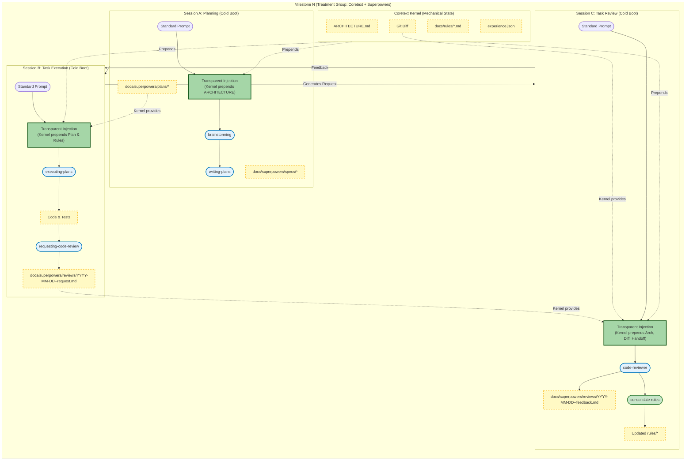

# Experimental Design: Superpowers vs. Superpowers + Coretext v2 (D-SDD)

---

## 1. Theoretical Foundations (The 5 Benchmarks)

We replace snapshot-based evaluation with a continuous, evolutionary benchmark based on five models:

- **SlopCodeBench (arxiv:2603.24755):** Iterative Trajectory model.
  - Agent extends its *own prior code* across 5 checkpoints.
  - Measures: **Structural Erosion** (God Components) and **Verbosity** (redundant code).
- **ProjDevBench (arxiv:2602.01655):** Strict Constraint / Black-Box model.
  - Specifies *only* external behavior and global invariants (e.g., "URL-state only").
  - Internal architectural decisions are left to the agent.
- **SWE-CI (arxiv:2603.03823):** Maintainability via Evolution.
  - Evaluates via **EvoScore**, weighting later milestones (4 & 5) higher to penalize technical debt.
- **EvoClaw (arxiv:2603.13428):** Develop-in-place, evaluate-in-isolation.
  - Milestones operate on the persistent Git state.
  - Measures: **Recall** (adding new features) vs. **Precision** (preventing regressions).
- **Interaction Smells (arxiv:2603.09701v2):** Qualitative penalty ledger.
  - Tracks **Must-Do Omission** and **Must-Not Violate** events.

---

## 2. Experimental Setup & Constraints

Both groups operate in identical environments to isolate context management as the single variable.

### Shared Constraints (The "Fairness" Rules)

- **Identical Starting State:** Empty React app with root `ARCHITECTURE.md` (Global Invariants).
- **Identical Iteration Lifecycle:** Hard context wipes per milestone and task.
  - **Phase 1 (Planning):** Receive Requirement -> Draft Plan -> *Wipe Context*.
  - **Phase 2 (Execution):** Implement ONE task -> Generate Review Request -> *Wipe Context*.
  - **Phase 3 (Review):** Audit Diff -> *Wipe Context*. (Loop back to Phase 2 until done).
- **Identical LLM & Harness:** `Gemini 3.1 Pro Preview` via `Gemini CLI`.
- **Identical Prompting:** Exact same prompts across all sessions.
- **Zero Human Intervention:** Human operator strictly acts as a dumb proxy (copy outputs, run requested standard CLI commands).
- **Unmodified Framework Primitives:** Superpowers skills (`brainstorming`, `writing-plans`, etc.) remain completely vanilla.

---

## 2.5 Step 0: The Universal Epoch

Establish the baseline environment to isolate scaffolding noise.

- **The `experiments` Base Branch:**
  - Base branch `experiments` (from `transition-to-sdd`).
  - Contains empty `trore` React app with testing environment:
    ```bash
    npm create react@latest trore -- --template react
    cd trore && npm install
    npm install -D vitest jsdom @testing-library/react @testing-library/jest-dom
    ```
  - Pre-seeded `ARCHITECTURE.md` with 3 Global Invariants.
- **Initialize Isolated Worktrees:**
  - Create isolated directories using `git worktree`:
    ```bash
    git worktree add ../.worktrees/coretext--exp-d -b coretext--exp-d experiments
    git worktree add ../.worktrees/coretext--exp-e -b coretext--exp-e experiments
    ```
  - `coretext--exp-d`: **Control Group (Superpowers)**
  - `coretext--exp-e`: **Treatment Group (Coretext v2)**

---

## 3. Control Group: Superpowers Alone

**Philosophy:** Relies on LLM's internal attention, prompt injection, and forced reading to maintain architectural discipline.

**Workflow per Milestone (Manual Orchestration):**

- **Phase 1: Planning (Session A - Cold Boot)**
  - **Input:** `User Requirement` for Milestone *N*.
  - **Prompt:** `"Use the brainstorming and writing-plans skills to design and plan this feature. **CRITICAL OVERRIDE:** Do not ask any clarifying questions, do not offer the visual companion, and do not wait for user approval. **You MUST explore the project structure and read existing architecture docs first.** Make reasonable assumptions for any ambiguities and immediately write the spec and the implementation plan."`
- **Phase 2: Task Execution (Session B - Cold Boot)**
  - **Prompt:** `"Read the latest plan in docs/superpowers/plans/. Use the executing-plans skill to step through this document. For each task, use test-driven-development to make the tests pass. If you encounter any failures, you must use systematic-debugging to find the root cause. When the task is complete, you must use verification-before-completion to prove the tests pass, and finally use the requesting-code-review skill to generate a handoff document in docs/superpowers/reviews/YYYY-MM-DD-<feature-name>-request.md and HALT."`
- **Phase 3: Task Review (Session C - Cold Boot)**
  - **Prompt:** `"Use the code-reviewer skill to review the latest changes in the working tree. **You MUST locate and read the project's root architecture file and the review request in docs/superpowers/reviews/** to ensure no global constraints were violated. Output your feedback."`
  - *Result:* Rejection returns to Session B; Approval moves Session B to the next task.

**Expected Failure Mode:** *Constraint Amnesia* by Milestone 3 or 4. The agent will fail to find `ARCHITECTURE.md` or read its long-form plans, causing a "Must-Not Violate" smell.

---

## 4. Treatment Group: Superpowers + Coretext v2 (D-SDD)

**Philosophy:** Superpowers acts as ephemeral "User-Space" execution skills; Coretext v2 is the "Kernel" enforcing state transfer and review. Prompts are identical, minus manual search instructions.

**Workflow per Milestone (Coretext Kernel Orchestration):**

- **Phase 1: Planning (Session A - Cold Boot)**
  - **Context:** Kernel passively prepends `ARCHITECTURE.md`. (not yet implemented)
    - **Input:** `User Requirement` for Milestone *N*.
  - **Prompt:** `"Use the brainstorming and writing-plans skills to design and plan this feature. **CRITICAL OVERRIDE:** Do not ask any clarifying questions, do not offer the visual companion, and do not wait for user approval. **You MUST explore the project structure and read existing architecture docs first.** Make reasonable assumptions for any ambiguities and immediately write the spec and the implementation plan."`
- **Phase 2: Task Execution (Session B - Cold Boot)**
  - **Context:** Kernel passively prepends `docs/superpowers/plans/*` and `docs/rules/*.md`. (not yet implemented)
  - **Prompt:** `"Read the latest plan in docs/superpowers/plans/. Use the executing-plans skill to step through this document. For each task, use test-driven-development to make the tests pass. If you encounter any failures, you must use systematic-debugging to find the root cause. When the task is complete, you must use verification-before-completion to prove the tests pass, and finally use the requesting-code-review skill to generate a handoff document in docs/superpowers/reviews/YYYY-MM-DD-<feature-name>-request.md and HALT."`
- **Phase 3: Task Review (Session C - Cold Boot)**
  - **Context:** Kernel passively prepends `ARCHITECTURE.md`, Git Diff, and Handoff Document. (not yet implemented)
  - **Prompt:** `"Use the code-reviewer skill to review the latest changes in the working tree. **You MUST locate and read the project's root architecture file and the review request in docs/superpowers/reviews/** to ensure no global constraints were violated. Output your feedback. If the milestone is fully complete and approved, you MUST use the consolidate-rules skill to extract architectural lessons."`
  - *Result:* Rejection re-boots Session B with feedback; Approval extracts lessons to `docs/rules/` and moves to the next task.

**Expected Success Mode:** Reviewer boots cold, immune to context exhaustion. It mechanically blocks Structural Erosion by relying strictly on injected Context & Diff.

---

## 5. Evaluation & Measurement

- **Automated Testing (F2P / P2P):** Calculate **Recall** (features added) and **Precision** (regressions prevented) via `checkpoints.md` tests.
- **Interaction Smell Audit:** Check for Must-Do Omission (e.g., missing `X-Trore-Auth: v1-alpha` header in Milestone 4).
- **Structural Erosion & Verbosity Analysis:** Measure Cyclomatic Complexity mass and structural duplication at Milestone 5 (SlopCodeBench metrics).
- **EvoScore:** Calculate future-weighted SWE-CI score to measure maintainability trajectory.

---

## 6. Context Management Comparison Diagrams

The core variable in this experiment is **how context is managed across isolated sessions**. Both groups execute identically prompted workflows to maintain scientific validity, differing only in the presence of Coretext's transparent state injection.

### Diagram A: Control Group (Superpowers Alone)

In the Control Group, context transfer relies entirely on the LLM's initiative to search the filesystem and its memory to adhere to constraints across sessions.


### Diagram B: Treatment Group (Superpowers + Coretext v2)

In the Treatment Group, the agent receives the exact same prompts (without the forced manual search instructions). Coretext acts as a **"Symbiotic Wrapper,"** injecting context completely transparently.

