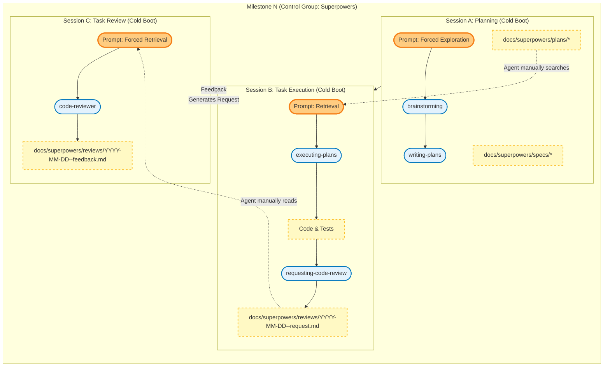

# Experimental Design: Superpowers vs. Superpowers + Coretext v2 (D-SDD)

---

## 1. Theoretical Foundations (The 5 Benchmarks)

This experiment abandons the flawed "snapshot-based" evaluation paradigm in favor of a continuous, evolutionary benchmark. Our methodology is directly synthesized from five recent breakthroughs in AI software engineering evaluation:

1.  **SlopCodeBench (arxiv:2603.24755):** We adopt the **Iterative Trajectory** model. The agent is forced to extend its *own prior code* across 5 checkpoints. We measure **Structural Erosion** (complexity concentrating in God Components) and **Verbosity** (redundant code) as the primary indicators of framework failure.
2.  **ProjDevBench (arxiv:2602.01655):** We adopt the **Strict Constraint / Black-Box** model. The problem specifies *only* the external behavior and absolute global invariants (e.g., "URL-state only"). We do not prescribe internal React component structures, forcing the agent to make (and live with) its own architectural decisions.
3.  **SWE-CI (arxiv:2603.03823):** We adopt the concept of **Maintainability via Evolution**. We will calculate an **EvoScore** for the final output, weighting the success of later milestones (Checkpoints 4 & 5) higher than the initial MVP to penalize technical debt accumulation.
4.  **EvoClaw (arxiv:2603.13428):** We adopt the **Develop-in-place, evaluate-in-isolation** pipeline. Each milestone operates on the persistent Git state of the previous one. We measure the divergence between **Recall** (ability to add the new map view) and **Precision** (preventing the regression of the previous URL filter logic).
5.  **Interaction Smells (arxiv:2603.09701v2):** We use this taxonomy as our qualitative penalty ledger. Specifically, we will track **Must-Do Omission** and **Must-Not Violate** events (e.g., when Superpowers forgets the global URL constraint and uses `useState`).

---

## 2. Experimental Setup & Constraints

To ensure absolute scientific validity, both the Control and Treatment groups must operate under an identical environment. The *only* independent variable is the framework's mechanism for managing context across isolated sessions.

### Shared Constraints (The "Fairness" Rules)

1.  **Identical Starting State:** Both experiments begin with an empty Git repository containing only boilerplate code (an empty React app) and a root `ARCHITECTURE.md` file pre-seeded with the Global Invariants from `checkpoints.md`.
2.  **Identical Iteration Lifecycle (The Iterative Task Loop):** To prevent the Control group from suffering an artificial disadvantage due to longer single-session context bloat, both frameworks must undergo hard context wipes per milestone and per task:
    *   **Phase 1: Planning (Session A):** Agent receives the `User Requirement` and drafts the plan. *Context wiped.*
    *   **Phase 2: Task Execution (Session B):** Agent writes the code to implement ONE task from the plan and generates a review request. *Context wiped.*
    *   **Phase 3: Task Review (Session C):** Agent reviews the git diff against the review request and Global Invariants. *Context wiped.*
    *   *The Execution <-> Review loop repeats for each task until the plan is complete.*
3.  **Identical Underlying LLM and Harness:** Both groups must use the exact same LLM model `Gemini 3.1 Pro Preview` and the exact same terminal harness `Gemini CLI` to rule out base-model and harness variance
4.  **Identical Prompting (No specialized Agents):** Both groups are orchestrated using the **exact same prompts** during Sessions A, B, and C. 
5.  **Zero Human Intervention (Post-Kickoff):** The human operator acts strictly as a dumb proxy. The operator may only copy outputs to the next session or run standard CLI commands (like `npm run test` or `git commit`) as explicitly requested by the agent. No manual fixing of code, hinting, or correcting hallucinated paths.
6.  **Unmodified Framework Primitives:** The core Superpowers skills (`brainstorming`, `writing-plans`, etc.) must remain completely vanilla and unmodified. Coretext is allowed to *wrap* them or force-feed context before invoking them, but it cannot rewrite the underlying skill definitions to cheat.

---

## 2.5 Step 0: The Universal Epoch

Before executing Milestone 1 for either group, the human operator must establish the exact baseline environment. This isolates the frameworks from scaffolding noise and ensures both groups start from the exact same commit.

1.  **The `experiments` Base Branch:**
    *   Ensure your repository has a base branch named `experiments` (branched from `transition-to-sdd`).
    *   This branch must already contain the empty `trore` React boilerplate app with a pre-configured testing environment.
        ```bash
        npm create react@latest trore -- --template react
        cd trore && npm install
        npm install -D vitest jsdom @testing-library/react @testing-library/jest-dom
        ```
    *   *Note: Ensure `vitest` is configured (e.g., adding a `"test": "vitest"` script to `package.json` and basic setup in `vite.config.js`) so that agents can immediately run `npm run test` without struggling with scaffolding.*
    *   The root `ARCHITECTURE.md` is pre-seeded with the 3 Global Invariants.
2.  **Initialize Isolated Worktrees:**
    *   Using `git worktree` is the recommended best practice for this benchmark. It provides two physically isolated directories, preventing accidental cross-contamination of generated files, ignored files, or `node_modules`.
    *   Create two new branches linked to isolated worktrees based on the `experiments` branch:
        ```bash
        git worktree add ../.worktrees/coretext--exp-d -b coretext--exp-d experiments
        git worktree add ../.worktrees/coretext--exp-e -b coretext--exp-e experiments
        ```
    *   `coretext--exp-d` will serve as the directory for the **Control Group (Superpowers)**.
    *   `coretext--exp-e` will serve as the directory for the **Treatment Group (Coretext v2)**.
    *   `cd` into the respective worktree directories before beginning Milestone 1 Session A.

---

## 3. Control Group: Superpowers Alone

**Philosophy:** Relying on massive prompt injection, long-form document reading, and the LLM's internal attention mechanism to maintain architectural discipline.

**Workflow per Milestone (Orchestrated Manually):**
*The human operator physically breaks the milestone into discrete, cold-booted agent processes matching the Iterative Task Loop.*

1.  **Phase 1: Planning (Session A)**
    *   Boot a fresh Gemini CLI session.
    *   Input: `User Requirement` for Milestone *N*.
    *   Action: Instruct the agent: `"Use the brainstorming and writing-plans skills to design and plan this feature. **CRITICAL OVERRIDE:** Do not ask any clarifying questions, do not offer the visual companion, and do not wait for user approval. **You MUST explore the project structure and read existing architecture docs first.** Make reasonable assumptions for any ambiguities and immediately write the spec and the implementation plan."` The agent is expected to explore the filesystem to discover `ARCHITECTURE.md` and past context.
    *   *Session terminates.*
2.  **Phase 2: Task Execution (Session B)**
    *   Boot a fresh Gemini CLI session.
    *   Input: No context provided.
    *   Action: Instruct the agent: `"Read the latest plan in docs/superpowers/plans/. Use the executing-plans skill to step through this document. For each task, use test-driven-development to make the tests pass. If you encounter any failures, you must use systematic-debugging to find the root cause. When the task is complete, you must use verification-before-completion to prove the tests pass, and finally use the requesting-code-review skill to generate a handoff document in docs/superpowers/reviews/YYYY-MM-DD-<feature-name>-request.md and HALT."`
    *   *Session terminates. Wait for Session C.*
3.  **Phase 3: Task Review (Session C)**
    *   Boot a fresh Gemini CLI session.
    *   Input: No context provided.
    *   Action: Instruct the agent: `"Use the code-reviewer skill to review the uncommitted changes in the working tree. **You MUST locate and read the project's root architecture file and the review request in docs/superpowers/reviews/** to ensure no global constraints were violated. Output your feedback."`
    *   *Session terminates.*
    *   *If rejected, return to Session B with the feedback. If approved, Session B moves to the next task in the plan.*

**Expected Failure Mode:** By Milestone 3 or 4, the agent will experience *Constraint Amnesia*. During Phase 1 or 2, it will fail to proactively search for `ARCHITECTURE.md` or fail to read its own previous long-form plan documents deeply enough, resulting in a "Must-Not Violate" Interaction Smell.

---

## 4. Treatment Group: Superpowers + Coretext v2 (D-SDD)

**Philosophy:** Treating Superpowers as ephemeral "User-Space" execution skills, governed by Coretext v2 as the strict "Kernel" enforcing state transfer and review. To prove the efficacy of the Kernel, the prompts are **identical** to the Control group, minus the forced instructions to locate files.

**Workflow per Milestone (Orchestrated by Coretext Kernel):**
*Coretext v2 physically breaks the milestone into discrete, cold-booted agent processes, injecting the exact required state transparently.*

1.  **Phase 1: Planning (Session A)**
    *   Boot a standard Gemini CLI session.
    *   Input: `User Requirement` for Milestone *N* + **CRITICAL OVERRIDE** (Do not ask clarifying questions... Make reasonable assumptions and immediately write the spec and plan).
    *   Action: *(Kernel has passively prepended `ARCHITECTURE.md` to context).* Agent uses Superpowers' `brainstorming` and `writing-plans` skills to generate `docs/superpowers/specs/*` and `docs/superpowers/plans/*`.
    *   *Session terminates.*
2.  **Phase 2: Task Execution (Session B)**
    *   Boot a standard Gemini CLI session.
    *   Input: `"Use the executing-plans skill to step through the plan. For each task, use test-driven-development to make the tests pass. If you encounter any failures, you must use systematic-debugging to find the root cause. When the task is complete, you must use verification-before-completion to prove the tests pass, and finally use the requesting-code-review skill to generate a handoff document in docs/superpowers/reviews/YYYY-MM-DD-<feature-name>-request.md and HALT."`
    *   Action: *(Kernel has passively prepended `docs/superpowers/plans/*` and `docs/rules/*.md`).* Agent physically trapped; it must make the Planner's tests pass and generate the handoff artifact.
    *   *Session terminates. Wait for Session C.*
3.  **Phase 3: Task Review (Session C)**
    *   Boot a standard Gemini CLI session.
    *   Input: `"Use the code-reviewer skill to review the uncommitted changes in the working tree. Output your feedback. If the milestone is fully complete and approved, you MUST use the consolidate-rules skill to extract architectural lessons."`
    *   Action: *(Kernel has passively prepended `ARCHITECTURE.md`, the Diff, and `docs/superpowers/reviews/YYYY-MM-DD-<feature-name>-request.md`).* Audits the code. If Superpowers used `useState`, the Reviewer mechanically rejects the commit. If approved, it extracts lessons to `docs/rules/`.
    *   *Session terminates.*
    *   *If rejected, Kernel boots Session B with the feedback. If approved, Session B moves to the next task in the plan.*

**Expected Success Mode:** Because the Reviewer boots completely cold and reads *only* the Diff and the Architecture rules provided transparently by the Kernel, it is immune to context exhaustion. It will mechanically block the Structural Erosion that Superpowers attempts to introduce in Milestone 3 and 5.

---

## 5. Evaluation & Measurement

After both frameworks complete (or fail) the 5 milestones, we will evaluate the resulting Git repositories:

1.  **Automated Testing (F2P / P2P):** Run the test assertions defined in `checkpoints.md`. 
    *   *Calculation:* Determine the **Recall** (features added) and **Precision** (regressions prevented) for each framework as defined in `EvoClaw`.
2.  **Interaction Smell Audit (Must-Do Omission):** Check if the agent successfully included the `X-Trore-Auth: v1-alpha` header in Milestone 4. This explicitly tests if JIT injection prevents *Constraint Amnesia* (from `ProjDevBench` / `Interaction Smells`).
3.  **Structural Erosion & Verbosity Analysis:** Analyze the codebase at Milestone 5 using the SlopCodeBench metrics. Measure Cyclomatic Complexity mass concentration and structural duplication (Verbosity) to see which framework degrades faster under refactoring pressure.
4.  **EvoScore:** Calculate the final SWE-CI EvoScore (future-weighted mean of normalized changes), proving that Coretext v2 maintained a higher trajectory of maintainability over the 5 iterations.

---

## 6. Context Management Comparison Diagrams

The core variable in this experiment is **how context is managed across isolated sessions**. Both groups execute identically prompted workflows to maintain scientific validity, differing only in the presence of Coretext's transparent state injection.

### Diagram A: Control Group (Superpowers Alone)

In the Control Group, context transfer relies entirely on the LLM's initiative to search the filesystem and its memory to adhere to constraints across sessions.



### Diagram B: Treatment Group (Superpowers + Coretext v2)

In the Treatment Group, the agent receives the exact same prompts (without the forced manual search instructions). Coretext acts as a **"Symbiotic Wrapper,"** injecting context completely transparently.

```mermaid
flowchart TB
    classDef session fill:#e8eaf6,stroke:#1a237e,stroke-width:2px;
    classDef skill fill:#e3f2fd,stroke:#0277bd,stroke-width:2px;
    classDef coretext_skill fill:#c8e6c9,stroke:#2e7d32,stroke-width:2px;
    classDef artifact fill:#fff9c4,stroke:#fbc02d,stroke-width:2px,stroke-dasharray: 5 5;
    classDef difference fill:#a5d6a7,stroke:#1b5e20,stroke-width:3px;
    classDef inject fill:#eceff1,stroke:#37474f,stroke-width:2px,stroke-dasharray: 5 5;

    subgraph Milestone ["Milestone N (Treatment Group: Coretext + Superpowers)"]
        direction TB

        subgraph Inject ["Coretext Kernel (Mechanical State)"]
            direction LR
            K_Arch[ARCHITECTURE.md]:::artifact
            K_Hint[docs/rules/*.md]:::artifact
            K_Exp[experience.json]:::artifact
            K_Diff[Git Diff]:::artifact
        end

        subgraph SessionA ["Session A: Planning (Cold Boot)"]
            direction TB
            InputA([Standard Prompt])
            ContextA["Transparent Injection<br/>(Kernel prepends ARCHITECTURE)"]:::difference
            Skill_Brainstorm([brainstorming]):::skill
            Skill_Plan([writing-plans]):::skill
            
            InputA --> ContextA
            ContextA --> Skill_Brainstorm
            Skill_Brainstorm --> Skill_Plan
            
            Art_Spec[docs/superpowers/specs/*]:::artifact
            Art_Plan[docs/superpowers/plans/*]:::artifact
        end

        subgraph SessionB ["Session B: Task Execution (Cold Boot)"]
            direction TB
            InputB([Standard Prompt])
            ContextB["Transparent Injection<br/>(Kernel prepends Plan & Rules)"]:::difference
            Skill_Exec([executing-plans]):::skill
            Skill_ReqReview([requesting-code-review]):::skill
            Art_Code[Code & Tests]:::artifact
            Art_Handoff[docs/superpowers/reviews/YYYY-MM-DD-<feature-name>-request.md]:::artifact
            
            Art_Plan -. "Kernel provides" .-> ContextB
            InputB --> ContextB
            ContextB --> Skill_Exec
            Skill_Exec --> Art_Code
            Art_Code --> Skill_ReqReview
            Skill_ReqReview --> Art_Handoff
        end

        subgraph SessionC ["Session C: Task Review (Cold Boot)"]
            direction TB
            InputC([Standard Prompt])
            ContextC["Transparent Injection<br/>(Kernel prepends Arch, Diff, Handoff)"]:::difference
            Skill_Review([code-reviewer]):::skill
            Skill_Knowledge([consolidate-rules]):::coretext_skill
            Art_Feedback[docs/superpowers/reviews/YYYY-MM-DD-<feature-name>-feedback.md]:::artifact
            Art_UpdateKnowledge[Updated rules/*]:::artifact
            
            Art_Handoff -. "Kernel provides" .-> ContextC
            K_Diff -. "Kernel provides" .-> ContextC
            InputC --> ContextC
            ContextC --> Skill_Review
            Skill_Review --> Art_Feedback
            Skill_Review --> Skill_Knowledge
            Skill_Knowledge --> Art_UpdateKnowledge
        end
        
        Inject -. "Prepends" .-> ContextA
        Inject -. "Prepends" .-> ContextB
        Inject -. "Prepends" .-> ContextC
        
        SessionA --> SessionB
        SessionB -->|Generates Request| SessionC
        SessionC -->|Feedback| SessionB
    end
```` 
