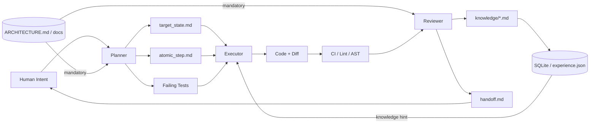
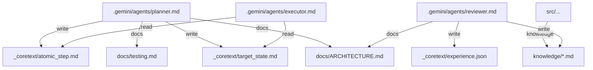

# BÁO CÁO NGÀY 07/04/2026

Báo cáo này trả lời trực tiếp các yêu cầu trong `## **BIÊN BẢN NGÀY 09/03/2026**` của `/Users/mac/Git/coretext/docs/report/report_thesis.md`. Trọng tâm là: phân tích định tính rõ hơn cho hai phương pháp đã thử, chỉ ra lỗi sai theo từng bước trung gian, làm rõ giá trị và giới hạn của đồ thị tri thức, cập nhật hướng kiến trúc mới của Coretext, và đề xuất benchmark chính thức thay cho thí nghiệm tự tạo.

## 1. Kết luận ngắn

Điểm rút ra chính không phải là “file-based tốt” hay “graph-based tốt”, mà là:

1. BMad/file-based giữ được ràng buộc kiến trúc tốt hơn vì tài liệu toàn cục luôn có mặt, nhưng cách đi từng bước quá cứng làm mất ý gốc khi `architecture.md` và `prd.md` bị nén thành `epics.md`.
2. Coretext v1 lấy lại được một phần yêu cầu chéo tài liệu và tiết kiệm token hơn, nhưng lại bỏ mất ràng buộc kiến trúc toàn cục vì để agent tự nhớ dùng `query_knowledge`.
3. Vì vậy Coretext v2 không đi theo hướng “semantic only” nữa. Nó tách rõ:
   - Context mềm: gợi ý, liên tưởng, tri thức cục bộ.
   - Context cứng: kiến trúc, test, lint, rule toàn cục, phải được đưa vào một cách bắt buộc.

## So sánh định tính hai phương pháp

| Tiêu chí                   | Exp-B: File-based / BMad               | Exp-C: Coretext v1 / graph               | Ý nghĩa                                                 |
| -------------------------- | -------------------------------------- | ---------------------------------------- | ------------------------------------------------------- |
| Tuân thủ kiến trúc         | 93.0%                                  | 65.1%                                    | File-based an toàn hơn vì luôn có toàn bộ luật toàn cục |
| Tổng độ khớp đặc tả        | 92.7%                                  | 75.9%                                    | Exp-C hụt điểm chủ yếu ở kiến trúc                      |
| Hiệu quả token toàn Epic 1 | Kém hơn                                | Tốt hơn 5.4%                             | Graph có lợi về chi phí tổng                            |
| Story 1-3                  | Bỏ sót FR3 trong PRD                   | Tìm được FR3 qua truy xuất chéo tài liệu | Graph có lợi khi yêu cầu nằm rải giữa nhiều tài liệu    |
| Story 1-5                  | Mơ hồ vì `epics.md` không có story này | Cũng mơ hồ, còn bị kéo bởi node lân cận  | Cả hai cùng lộ ra lỗi của tài liệu trung gian           |

Kết quả này khớp với cả báo cáo định lượng trong `/Users/mac/Git/coretext/docs/report/project3.md` và báo cáo định tính trong `/Users/mac/Git/coretext/experiments/trore/results/comparison/qualitative-comparison.md`.

## 3. Lỗi sai theo từng bước trung gian

### Exp-B: lỗi bắt đầu từ bước nén tài liệu, không phải chỉ ở bước sinh code

Điểm mạnh của Exp-B là đọc file trực tiếp nên `architecture.md` luôn hiện diện. Nhưng lỗi của nó nằm ở chỗ pipeline BMad xem `epics.md` như hợp đồng cục bộ quá cứng.

Hai ví dụ rõ nhất:

1. **Story 1-3**: FR3 về keyword search có trong `prd.md`, nhưng trong `epics.md` của Story 1.3 lại không nhắc rõ. Agent đi đúng theo AC cục bộ của Epic, nhưng sai theo yêu cầu gốc. Điều này cho thấy cấu trúc step-by-step quá cứng có thể làm rơi mất ý ban đầu khi đi từ `architecture.md` và `prd.md` sang `epics.md`.
2. **Story 1-5**: story này không được hình thức hóa đầy đủ trong `epics.md`. Khi đó cả hai phương pháp đều phải suy đoán. Nghĩa là lỗi không chỉ ở agent, mà còn ở chính tài liệu trung gian. Nếu tài liệu trung gian mất thông tin, agent đi đúng quy trình vẫn có thể đi sai sản phẩm.

Kết luận cho Exp-B là: chỉ dựa vào một luồng chỉ dẫn ngữ nghĩa cứng, theo tầng bậc, là chưa đủ. Cần ít tài liệu trung gian hơn, hoặc phải có cơ chế giữ lại các ràng buộc gốc một cách xác định.

### Exp-C: lỗi bắt đầu từ bước truy xuất, trước cả khi code được sinh

Coretext v1 sửa được một nhược điểm của Exp-B: nó có thể nối yêu cầu từ nhiều tài liệu. Story 1-3 là ví dụ tốt nhất. Query `"Requirements for seeker discovery grid"` đã kéo được cả `prd.md#property-discovery-search`, nên FR3 được giữ lại.

Nhưng Exp-C lại lộ ra lỗi nặng hơn ở ràng buộc toàn cục:

1. Ở Stories 1-2 và 1-3, agent lấy được **0 node từ `architecture.md`**.
2. Không có story nào lấy được `architecture.md#structure-patterns`, tức phần quy định feature-folder.
3. Trong Story 1-5, vì `epics.md` không có story tương ứng, vector search trả về các node “hàng xóm gần nhất”, kéo theo scope creep và yêu cầu ảo.

Nói ngắn gọn: Coretext v1 để agent tự nhớ hỏi đúng câu hỏi. Đây là điểm bất định lớn nhất. Khi agent không hỏi đúng, luật toàn cục biến mất khỏi context.

Điều này cũng cho thấy một vấn đề thiết kế:

1. `query_knowledge` không phải cách làm tự nhiên nhất với agent CLI.
2. Nếu cấm agent đọc file và buộc đi qua tool riêng, ta vừa thêm bất định mới, vừa làm yếu khả năng bản địa của agent như đọc file, grep, diff, test, hoặc về sau là LSP.

## 4. Đồ thị tri thức có ích ở đâu, và không đủ ở đâu

Kết quả thí nghiệm cho thấy đồ thị tri thức **có ích**, nhưng **không thể là cửa vào duy nhất**.

### 4.1. Giá trị thật của đồ thị

1. Nó giúp lộ ra yêu cầu chéo tài liệu mà cách đọc tuyến tính dễ bỏ sót.
2. Nó giúp kiểm tra liên kết tài liệu, như lỗi referential integrity ở Story 1-4.
3. Nó có xu hướng tốt hơn khi đồ thị dày lên. Story 1-5 cho thấy khi graph đã được làm giàu qua các story trước, chênh lệch chất lượng thu hẹp còn 8 điểm trong khi token đầu vào giảm 30.6%.

### 4.2. Giới hạn thật của đồ thị

1. Luật toàn cục luôn là thứ khó truy xuất nhất bằng semantic search vì chúng “xa đều” với mọi story.
2. Nếu chunking sai, agent “có thông tin” nhưng vẫn không dùng được. Ví dụ file UX bị trả về như một khối JSON lớn.
3. Nếu thiếu edge rõ ràng từ story sang architecture, truy xuất theo ngữ nghĩa không bảo đảm lấy đúng luật cần lấy.

Kết luận ở đây là: đồ thị nên là **background intuition**, không phải **gatekeeper**.

## Vì sao Coretext v2 chuyển hướng

Kết luận:

1. Không nên dùng Coretext để thay thế native search.
2. Không nên biến SurrealDB hay graph database thành nguồn chân lý.
3. Không nên tiếp tục mở rộng một kiến trúc quá phức tạp chỉ để bù cho context window hữu hạn của model.

Hướng mới là:

1. **Markdown là semantic truth** cho specs, quyết định, tri thức dự án.
2. **Git là temporal truth** cho lịch sử thay đổi.
3. **SQLite hoặc một ledger tối giản** chỉ là lớp định tuyến có thể tái tạo.
4. **Coretext không cạnh tranh với GitNexus, LSP, hay AST.**
   - GitNexus hoặc các code graph tool lo code intelligence ở mức repo.
   - LSP lo symbol navigation và sửa đổi chính xác.
   - AST và linter lo kiểm tra cấu trúc cơ học.
   - Coretext lo phần mà các công cụ trên không giữ: ý định dự án, specs, rules, knowledge bằng markdown.

Nói cách khác: Coretext không nên ép agent “sống trong graph”. Coretext chỉ nên nhắc agent phần nào cần để ý, hoặc ép một số luật cứng phải có mặt.

## Deterministic-State-Driven Development: ít chỉ dẫn mềm hơn, nhiều ràng buộc cứng hơn

Từ các kết quả trên, Coretext v2 đi theo D-SDD với bộ nguyên tắc ngắn:

1. `ARCHITECTURE.md`, `docs/`, `knowledge/`, `skills/`, `templates/` là nguồn luật.
2. Code chỉ được viết khi có failing test do Planner tạo.
3. Không sửa kiến trúc chỉ để hợp thức hóa code đã viết.
4. Chỉ plan cho atomic step hiện tại.

Điểm mới quan trọng không phải là thêm nhiều prompt hơn, mà là giữ từng prompt ở mức tối thiểu, bắt buộc inject thông qua [[Hooks]] và chia rõ hai lớp:

### Semantic constraints

1. `target_state.md` giữ mục tiêu.
2. `atomic_step.md` giữ phạm vi rất nhỏ.
3. `knowledge/*.md` giữ tri thức cục bộ theo file hoặc theo vùng mã.
4. Reviewer làm semantic audit thay vì để Executor tự xác nhận mình đúng.

### Deterministic constraints

1. `ARCHITECTURE.md` và tài liệu kiểm thử phải được inject bắt buộc ở đúng vai trò.
2. Planner viết failing tests trước khi code được phép bắt đầu.
3. CI, lint, AST rule, sandbox là hàng rào cơ học.
4. Một số luật phải được ép vào context, không được chờ agent tự nhớ hỏi.

### Rút ra trực tiếp từ thí nghiệm Trore:

1. Exp-B cho thấy ngữ nghĩa cứng theo từng bước có thể làm mất ý gốc.
2. Exp-C cho thấy nếu chỉ dựa vào truy xuất ngữ nghĩa, kiến trúc toàn cục sẽ biến mất.
3. Vì vậy v2 phải là mô hình lai: ít tài liệu quy trình cồng kềnh hơn, nhưng ép mạnh hơn với luật toàn cục.

## 7. Các ràng buộc nền khi dùng LLM agents cho software engineering

Các ghi chú v2 đã chốt một số giả định nền tảng:

1. Agent rẻ hơn con người, nên có thể cho phép fail nhiều vòng hơn.
2. Agent sẽ mạnh hơn theo model mới, nhưng chuyện “nhớ mọi thứ” vẫn còn xa vì context window luôn hữu hạn.
3. Truyền ý định từ người sang planner, rồi sang executor, luôn có mất mát.
4. Phải có adversarial check độc lập.
5. LLM về bản chất không xác định, nên prompt không thể là lớp bảo đảm cuối cùng.

Vì thế Coretext v2 chọn cách giảm prompt boilerplate, nhưng tăng kiểm soát ở môi trường: test, lint, rule, inject bắt buộc, và review lạnh.

## 8. Vai trò và mức can thiệp của con người

Từ các tài liệu hiện có, có thể ghi rõ như sau:

1. **Experiment 1 (bootstrapping Coretext)** có can thiệp của con người ở mức cao. Người vận hành đóng vai trò “semantic router” và đã có manual intervention để xử lý drift của SurrealQL.
2. **Experiment 2 (Trore)** được thiết kế để giảm thiên lệch này bằng ràng buộc `Zero-File` cho Exp-C. Trong các tài liệu đang có, chưa thấy ghi nhận rõ một bước sửa code thủ công để làm cho sản phẩm chạy được. Can thiệp của con người chủ yếu nằm ở khâu thiết kế thí nghiệm, chuẩn bị tài liệu, và đánh giá kết quả.
3. Đây vẫn là một lỗ hổng ghi chép. Ở benchmark tiếp theo cần log rõ từng lần con người can thiệp: story nào, can thiệp gì, vì sao, và ảnh hưởng ra sao.

## 9. Hình minh họa cấu trúc và vòng đời tri thức

### 9.1. Luồng D-SDD

### 9.2. Cấu trúc node và cạnh chính

Hai hình trên được rút gọn từ `/Users/mac/Git/coretext/docs/coretext-example/coretext_flowchart.md` và `/Users/mac/Git/coretext/docs/coretext-example/lifecycle.md`.

## Đề xuất benchmark chính thức thay cho Trore

`Trore` vẫn hữu ích như pilot study vì nó đã làm lộ ra đúng các lỗi của Exp-B và Exp-C. Nhưng nó không đủ mạnh để làm benchmark chính cho luận văn vì:

1. tác giả cũng là người thiết kế hệ thống,
2. dữ liệu và quy trình còn mang tính nội bộ,
3. số lượng task còn nhỏ.

Hướng phù hợp hơn là dùng **SlopCodeBench** làm benchmark chính cho Coretext v2.

Lý do:
1. Nó đo được sự xói mòn chất lượng qua nhiều vòng bảo trì, đúng với bài toán “giữ state và giữ intent”.
2. Nó phù hợp hơn Trore để kiểm tra xem D-SDD có làm phẳng dốc suy giảm chất lượng theo thời gian hay không.
3. Nó buộc hệ thống chứng minh giá trị ở môi trường chuẩn hơn, thay vì chỉ trong một case tự dựng.

## 11. Kết luận

Biên bản ngày 09/03 yêu cầu phải đi xa hơn số liệu. Sau khi phân tích lại, có thể kết luận rõ:

1. BMad không thất bại vì thiếu tài liệu, mà vì quy trình quá cứng làm rơi ý khi ý gốc bị nén qua tài liệu trung gian.
2. Coretext v1 không thất bại vì graph vô dụng, mà vì nó dùng graph như cổng bắt buộc và để agent tự quyết định lúc nào hỏi đúng.
3. Coretext v2 vì vậy phải đi theo hướng tối giản hơn về harness, nhưng cứng hơn ở chỗ bắt buộc: luật toàn cục phải luôn có mặt, còn tri thức cục bộ mới để dưới dạng hint.

Đây là khác biệt chính giữa v1 và v2: v2 không cố thay thế năng lực tự nhiên của agent, mà chỉ bổ sung đúng phần agent còn thiếu nhất hiện nay, tức là giữ intent, giữ state, và giữ các ràng buộc toàn cục theo cách xác định.

## Nguồn chính

### Tài liệu trong repo `coretext`

1. `/Users/mac/Git/coretext/docs/report/report_thesis.md`
2. `/Users/mac/Git/coretext/docs/report/project3.md`
3. `/Users/mac/Git/coretext/experiments/trore/results/comparison/qualitative-comparison.md`
4. `/Users/mac/Git/coretext/docs/report/coretext_v2_dsdd_transition.md`
5. `/Users/mac/Git/coretext/AGENTS.md`
6. `/Users/mac/Git/coretext/docs/SDD_philosophy.md`
7. `/Users/mac/Git/coretext/docs/coretext-example/coretext_flowchart.md`
8. `/Users/mac/Git/coretext/docs/coretext-example/lifecycle.md`

### Ghi chú tổng hợp trong vault

1. [[coretext.memory.background_intuition|Coretext as Background Intuition over GitNexus and Native Search]]
2. [[coretext.dsdd.evolution|Evolution of State-Driven Development Architecture in Coretext]]
3. [[coretext.dsdd.minimalist_pivot|Minimalist State-Driven Development Pivot for Coretext]]
4. [[coretext.dsdd.v2_architecture|Architecting Deterministic State-Driven Development in Coretext v2]]
5. [[coretext.benchmarking.d_sdd_evaluation|Evaluating D-SDD with SlopCodeBench]]
