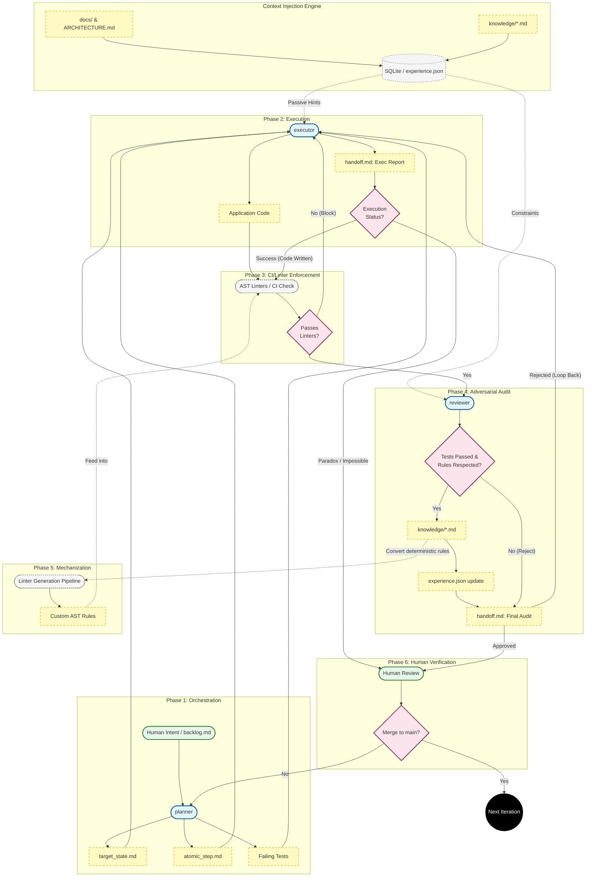

# BÁO CÁO NGÀY 07/04/2026

Báo cáo này giải quyết các vấn đề được nêu trong Biên bản ngày 09/03/2026, cung cấp phân tích định tính sâu sắc giữa hai phương pháp (Tệp phẳng/BMad vs Đồ thị tri thức/Coretext v1), những điểm sai lầm ở từng bước, sự thay đổi kiến trúc cốt lõi sang Coretext v2 (Deterministic State-Driven Development - D-SDD), và đề xuất sử dụng SlopCodeBench làm dự án mẫu chuẩn quốc tế.

---

## 1. Phân tích Định tính và So sánh Chi tiết (Coretext v1 vs BMad)

Dựa trên phân tích định lượng (token efficiency) và định tính từng bước (Story 1-1 đến 1-5), dưới đây là so sánh chi tiết khi sinh code và các lỗi sai của từng phương pháp:

### 1.1. Phương pháp Tệp phẳng - BMad (Experiment B)
- **Điểm mạnh:** Độ tuân thủ kiến trúc (Architecture compliance) rất cao (93.0%). Do tải toàn bộ file, các quy tắc toàn cục (global rules) luôn nằm trong ngữ cảnh.
- **Lỗi sai & Hạn chế:** BMad có cấu trúc quá cứng nhắc. Ở **Story 1-3**, phương pháp này mắc hiệu ứng "đường hầm phân cấp" (Hierarchical tunnel vision): Agent theo sát danh sách Acceptance Criteria (AC) cục bộ trong Epic mà bỏ lỡ hoàn toàn yêu cầu chéo tài liệu (cross-document) FR3 từ PRD.

### 1.2. Phương pháp Đồ thị Tri thức - Coretext v1 (Experiment C)
- **Điểm mạnh:** Hiệu suất sử dụng token tốt hơn tổng thể **5.4%** và giảm tới **30.6%** input token ở các task phức tạp (Story 1-5). Đồ thị giúp truy xuất chéo tài liệu rất tốt (khắc phục được lỗi thiếu FR3 của BMad ở Story 1-3).
- **Lỗi sai & Hạn chế (Mù Tích cấu/Topological Blindness):** 
  - Tuân thủ kiến trúc giảm mạnh chỉ còn **65.1%**. Đồ thị vector (SurrealDB) liên tục bỏ sót các quy tắc cấu trúc toàn cục (như cấu trúc feature-folder, state management) vì chúng nằm "quá xa" về mặt ngữ nghĩa (semantically equidistant) so với truy vấn tính năng cục bộ.
  - **Ở Story 1-5:** Do không có ràng buộc chặt chẽ, truy vấn vector trả về các node lân cận không liên quan, dẫn đến việc Agent "ảo giác" (hallucinate) và tự biên rải thêm phạm vi không có trong tài liệu.
  - Việc phụ thuộc vào Agent tự dùng tool `query_knowledge` là không mang tính xác định (non-deterministic) và tước đi sức mạnh của Agent.

**Kết luận so sánh:** Exp-B đánh đổi hiệu năng lấy sự an toàn (tuân thủ tốt nhưng tốn token và cứng nhắc), trong khi Exp-C tiết kiệm token nhưng mất đi tính toàn vẹn kiến trúc. Cần một phương pháp bắt buộc phải tiêm (inject) các ràng buộc ngữ cảnh một cách xác định (deterministic).

---

## 2. Cải tiến Kiến trúc: Coretext v2 và D-SDD

Nhận thấy sự thất bại của các framework quản lý cồng kềnh (harness frameworks) và vector search xác suất, kiến trúc đã được định hình lại thành **Coretext v2: Deterministic State-Driven Development (D-SDD)**.

### 2.1. Từ bỏ Cấu trúc Phức tạp sang Tối giản (Minimalist Pivot)
- **Chuyển đổi Database:** Loại bỏ cơ sở dữ liệu đồ thị đa phương thức phức tạp (SurrealDB). Chuyển sang sử dụng công cụ định tuyến siêu tối giản bằng **SQLite** (`experience.json`).
- **Phân tách Vai trò:** Coretext chỉ đóng vai trò "Trực giác nền" (Background Intuition) quản lý kiến thức dự án qua Markdown. Các công cụ mã nguồn chuyên dụng (như GitNexus, Language Server Protocol - LSP, Abstract Syntax Tree - AST) sẽ đảm nhiệm việc phân tích cấu trúc code. Không nên bắt Coretext cạnh tranh với Native Search hay LSP.

### Các Ràng buộc Cốt lõi của Tác tử AI (LLM Agents)
Việc áp dụng LLM Agents vào Software Engineering phải dựa trên các sự thật nền tảng:
1. Agent rẻ hơn con người.
2. Agent ngày càng thông minh hơn, nhưng một "Context Window" vô hạn và hoàn hảo vẫn còn rất xa.
3. Việc truyền tải ý định (Intent transferring) luôn luôn có độ hao hụt (lossy).
4. Phải có kiểm tra đối kháng (Adversarial check).
5. Các mô hình LLM về bản chất là **không xác định (non-deterministic)**.

### 2.3. Hợp đồng Đối kháng Đối xứng (Symmetrical Adversarial Contract)
- **Planner:** Dịch ý định của con người thành Mục tiêu (`target_state.md`), Phạm vi (`atomic_step.md`) và quan trọng nhất là viết các Test Case đang fail.
- **Executor:** Code để pass các Test Case đó, được hướng dẫn bởi các hint được tiêm thụ động từ SQLite.
- **Reviewer:** Thực hiện kiểm toán (Adversarial Audit) độc lập dựa trên `ARCHITECTURE.md` toàn cục.

### 2.4. Biến Kiến thức thành Ràng buộc Vật lý
Thay vì dùng "prompt slop" bằng ngôn ngữ tự nhiên không đáng tin cậy, D-SDD đẩy kiến thức xuống các công cụ cơ học: tạo ra các **Custom AST Linter Rules**. Linters đóng vai trò như một "hàng rào điện" (electric fence) không tốn token, ngay lập tức chặn lại các lỗi sinh code không xác định của LLM.

---

## 3. Hình ảnh Minh họa Đồ thị và Luồng hoạt động

Việc quản lý trạng thái của Coretext được biểu diễn qua Đồ thị và Sơ đồ luồng (Flowchart) sau:

### 3.1. Sơ đồ Luồng hoạt động D-SDD
### Coretext v2 Flowchart

### 3.2. Cấu trúc Đồ thị Vòng đời (Lifecycle Graph)

```mermaid
graph TD
    classDef agents fill:#2c3e50,stroke:#333,stroke-width:1px,color:white;
    classDef skills fill:#e67e22,stroke:#333,stroke-width:1px,color:black;
    classDef docs fill:#3498db,stroke:#333,stroke-width:1px,color:black;
    classDef knowledge fill:#2ecc71,stroke:#333,stroke-width:1px,color:black;
    classDef templates fill:#9b59b6,stroke:#333,stroke-width:1px,color:white;
    classDef archive fill:#95a5a6,stroke:#333,stroke-width:1px,color:black;
    classDef coretext fill:#e74c3c,stroke:#333,stroke-width:1px,color:white;
    classDef src fill:#1abc9c,stroke:#333,stroke-width:1px,color:black;
    classDef tests fill:#f1c40f,stroke:#333,stroke-width:1px,color:black;
    subgraph Planning_Phase
        _gemini_agents_planner_md[".gemini/agents/planner.md"]
        _coretext_target_state_md["_coretext/target_state.md"]
        _coretext_atomic_step_md["_coretext/atomic_step.md"]
        tests_unit_test_auth_py["tests/unit/test_auth.py"]
    end
    subgraph Execution_Phase
        _gemini_agents_executor_md[".gemini/agents/executor.md"]
        src_api_auth_py["src/api/auth.py"]
        _coretext_handoff_md["_coretext/handoff.md"]
    end
    subgraph Review_Audit_Phase
        _gemini_agents_reviewer_md[".gemini/agents/reviewer.md"]
        knowledge_bcrypt_rounds_md["knowledge/bcrypt_rounds.md"]
        _coretext_experience_json["_coretext/experience.json"]
        changelog_md["changelog.md"]
        docs_archive_handoff_001_md["docs/archive/handoff_001.md"]
        docs_archive_target_state_001_md["docs/archive/target_state_001.md"]
    end
    subgraph Global_Reference
        docs_ARCHITECTURE_md["docs/ARCHITECTURE.md"]
        docs_testing_md["docs/testing.md"]
        _agents_skills_test_driven_development_SKILL_md[".agents/skills/test-driven-development/SKILL.md"]
        templates_knowledge_template_md["templates/knowledge_template.md"]
        templates_target_state_template_md["templates/target_state_template.md"]
        templates_atomic_step_template_md["templates/atomic_step_template.md"]
    end
    _gemini_agents_planner_md -->|docs| docs_ARCHITECTURE_md
    _gemini_agents_planner_md -->|docs| docs_testing_md
    _gemini_agents_executor_md -->|docs| docs_testing_md
    _gemini_agents_reviewer_md -->|docs| docs_ARCHITECTURE_md
    src_api_auth_py -->|knowledge| knowledge_bcrypt_rounds_md
    _gemini_agents_reviewer_md -->|templates| templates_knowledge_template_md
    _gemini_agents_planner_md -->|templates| templates_target_state_template_md
    _gemini_agents_planner_md -->|templates| templates_atomic_step_template_md
    knowledge_bcrypt_rounds_md -->|archive| docs_archive_handoff_001_md
    docs_archive_handoff_001_md -->|archive| docs_archive_target_state_001_md
    tests_unit_test_auth_py -->|skills| _agents_skills_test_driven_development_SKILL_md
    _gemini_agents_planner_md -.->|read| docs_ARCHITECTURE_md
    _gemini_agents_planner_md -.->|modify| tests_unit_test_auth_py
    _gemini_agents_planner_md -.->|modify| _coretext_target_state_md
    _gemini_agents_planner_md -.->|modify| _coretext_atomic_step_md
    _gemini_agents_executor_md -.->|read| _coretext_target_state_md
    _gemini_agents_executor_md -.->|read| _coretext_atomic_step_md
    _gemini_agents_executor_md -.->|read| tests_unit_test_auth_py
    _gemini_agents_executor_md -.->|modify| src_api_auth_py
    _gemini_agents_executor_md -.->|modify| _coretext_handoff_md
    _gemini_agents_reviewer_md -.->|read| _coretext_target_state_md
    _gemini_agents_reviewer_md -.->|read| _coretext_atomic_step_md
    _gemini_agents_reviewer_md -.->|read| tests_unit_test_auth_py
    _gemini_agents_reviewer_md -.->|read| src_api_auth_py
    _gemini_agents_reviewer_md -.->|read| _coretext_handoff_md
    _gemini_agents_reviewer_md -.->|modify| knowledge_bcrypt_rounds_md
    _gemini_agents_reviewer_md -.->|modify| docs_ARCHITECTURE_md
    _gemini_agents_reviewer_md -.->|modify| changelog_md
    _gemini_agents_reviewer_md -.->|modify| _coretext_experience_json
    class templates_knowledge_template_md templates
    class _coretext_handoff_md coretext
    class _coretext_target_state_md coretext
    class _coretext_experience_json coretext
    class templates_target_state_template_md templates
    class tests_unit_test_auth_py tests
    class docs_ARCHITECTURE_md docs
    class _agents_skills_test_driven_development_SKILL_md skills
    class _gemini_agents_executor_md agents
    class knowledge_bcrypt_rounds_md knowledge
    class templates_atomic_step_template_md templates
    class docs_archive_handoff_001_md archive
    class _gemini_agents_reviewer_md agents
    class docs_archive_target_state_001_md archive
    class src_api_auth_py src
    class changelog_md docs
    class docs_testing_md docs
    class _gemini_agents_planner_md agents
    class _coretext_atomic_step_md coretext
```

---

## 4. Kế hoạch Đánh giá mới: SlopCodeBench thay thế Dự án Tự tạo

Để trả lời yêu cầu tìm kiếm một dự án mẫu có sẵn, tài liệu chi tiết và code chạy được nhằm đánh giá chuẩn xác, dự án sẽ loại bỏ bài test tự tạo (`trore`) và áp dụng tiêu chuẩn đánh giá quốc tế: **SlopCodeBench (arxiv:2603.24755)**.

### 4.1. Tại sao lại là SlopCodeBench?
Nghiên cứu của SlopCodeBench chứng minh thực nghiệm rằng việc phụ thuộc vào "prompt engineering" hoặc hướng dẫn ban đầu (như `anti_slop`, `plan_first`) sẽ **thất bại** trong các tác vụ bảo trì và phát triển dài hạn (long-horizon tasks). Các Agent khi mở rộng code của chính mình sẽ tạo ra:
- **Xói mòn cấu trúc (Structural Erosion):** Nhồi nhét logic vào các hàm khổng lồ ("god functions") thay vì cấu trúc lại code.
- **Dài dòng dư thừa (Verbosity):** Sinh code phòng thủ, vòng lặp thừa thãi và wrapper không cần thiết.

### Cách thực hiện Đánh giá
- Chúng ta sẽ lấy **Task đầu tiên** trong chuỗi SlopCodeBench làm ý định ban đầu (Greenfield Intent).
- 9+ task bảo trì tiếp theo sẽ được đẩy qua bộ ba **Planner-Executor-Reviewer**.
- Đánh giá sẽ đo xem việc sử dụng injection thụ động và các cổng kiểm duyệt của Coretext v2 có thực sự **làm giảm bớt độ dốc suy thoái** mà các mô hình mạnh nhất hiện tại (như Opus hay GPT) đều gặp phải hay không.
